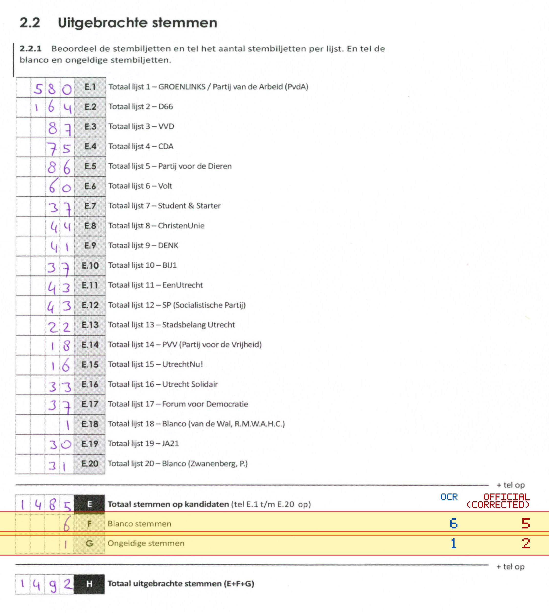
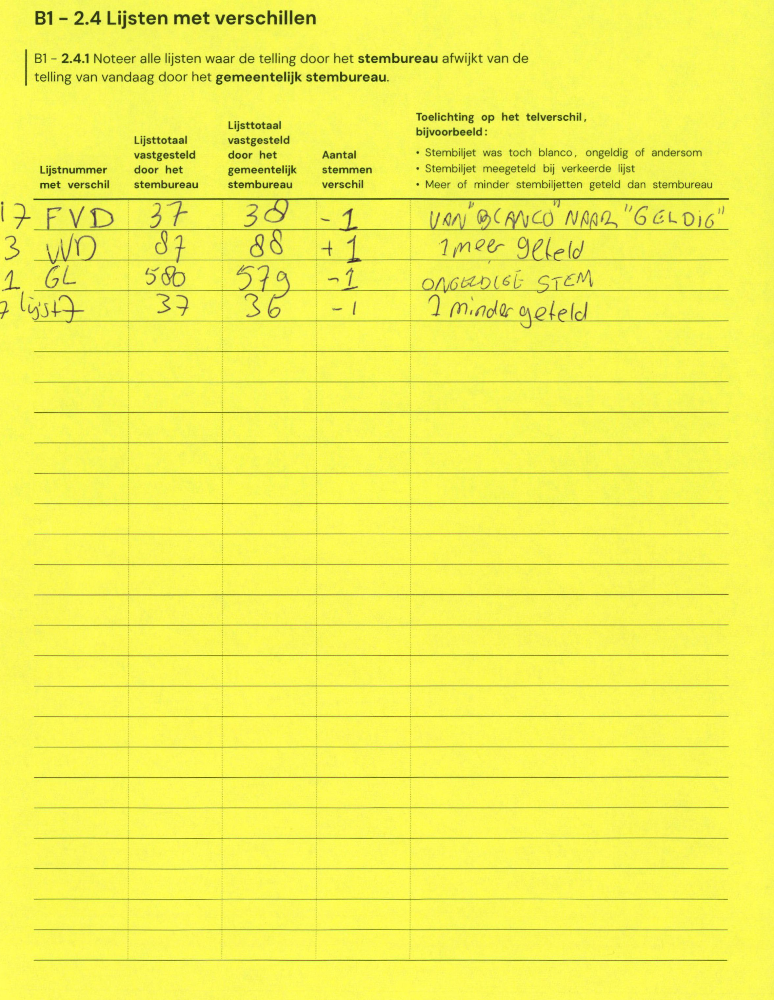

# Station 523 - Goeree 4

- Status: `mismatch`
- Markdown: `2026-GR/0344/results/Utrecht_523_Gymzaal_Goeree_4_GR26_eerste_telling.md`
- Correction OCR: `2026-GR/0344/results/corrections/Utrecht_523_Gymzaal_Goeree_4_GR26.md`

## Details

- F: md=6, official=5
- G: md=1, official=2

## Candidate Votes

- Status: `incomplete`
- Compared candidate cells: 0/508
- Candidate OCR files: 0
- candidate OCR not available
- known list/correction issues are shown

Legend: yellow/red = official CSV mismatch; blue = internal consistency issue. The right margin shows OCR and official values for official mismatches.



## Corrections

```markdown
| ID | First | Second | Difference | Note |
|---|---:|---:|---:|---|
| E.17 | 37 | 38 | 1 | VAN "BLANCO" NAAR "GELDIG" |
| E.3 | 87 | 88 | 1 | 1 meer geteld |
| E.1 | 580 | 579 | -1 | ONGELDIGE STEM |
| E.7 | 37 | 36 | -1 | 1 minder geteld |
```


