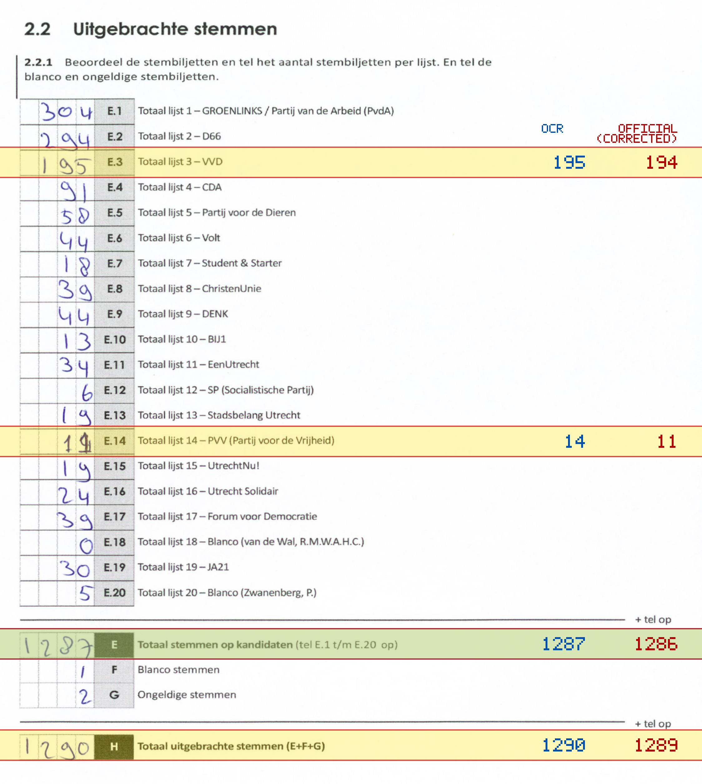
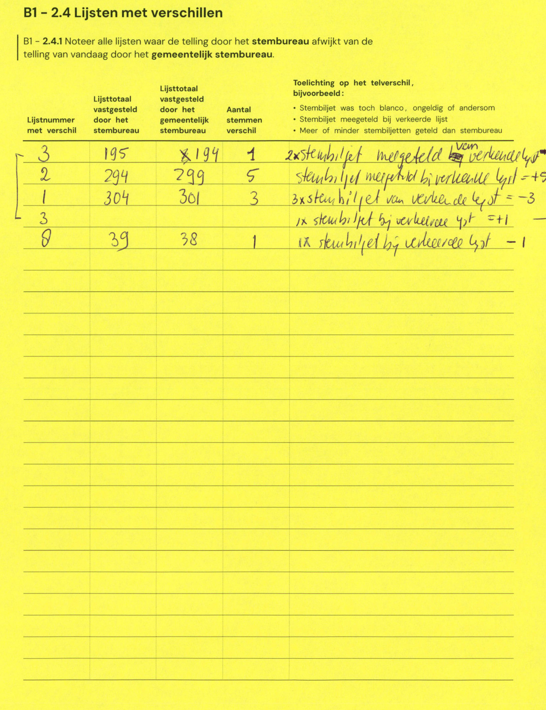

# Station 537 - Akkrumerraklaan 131 ingang via achterkant

- Status: `internally inconsistent`
- Markdown: `2026-GR/0344/results/Utrecht_537_Gymzaal_Voorn_GR26_eerste_telling.md`
- Correction OCR: `2026-GR/0344/results/corrections/Utrecht_537_Gymzaal_Voorn_GR26.md`

## Details

- E.1 through E.20 sum to 1290, but E is 1287
- E.3: md=195, official=194
- E.14: md=14, official=11
- E: md=1287, official=1286
- H: md=1290, official=1289

## Candidate Votes

- Status: `incomplete`
- Compared candidate cells: 0/508
- Candidate OCR files: 0
- candidate OCR not available
- known list/correction issues are shown

Legend: yellow/red = official CSV mismatch; blue = internal consistency issue. The right margin shows OCR and official values for official mismatches.



## Corrections

```markdown
| ID | First | Second | Difference | Note |
|---|---:|---:|---:|---|
| E.3 | 195 | 194 | -1 | 2x stembiljet meegeteld verkeerde lijst |
| E.2 | 294 | 299 | 5 | stembiljet meegeteld bij verkeerde lijst = +5 |
| E.1 | 304 | 301 | -3 | 3x stembiljet van verkeerde lijst = -3 |
| E.3 |  |  | 1 | 1x stembiljet bij verkeerde lijst = +1 |
| E.8 | 39 | 38 | -1 | 1x stembiljet bij verkeerde lijst - 1 |
```


