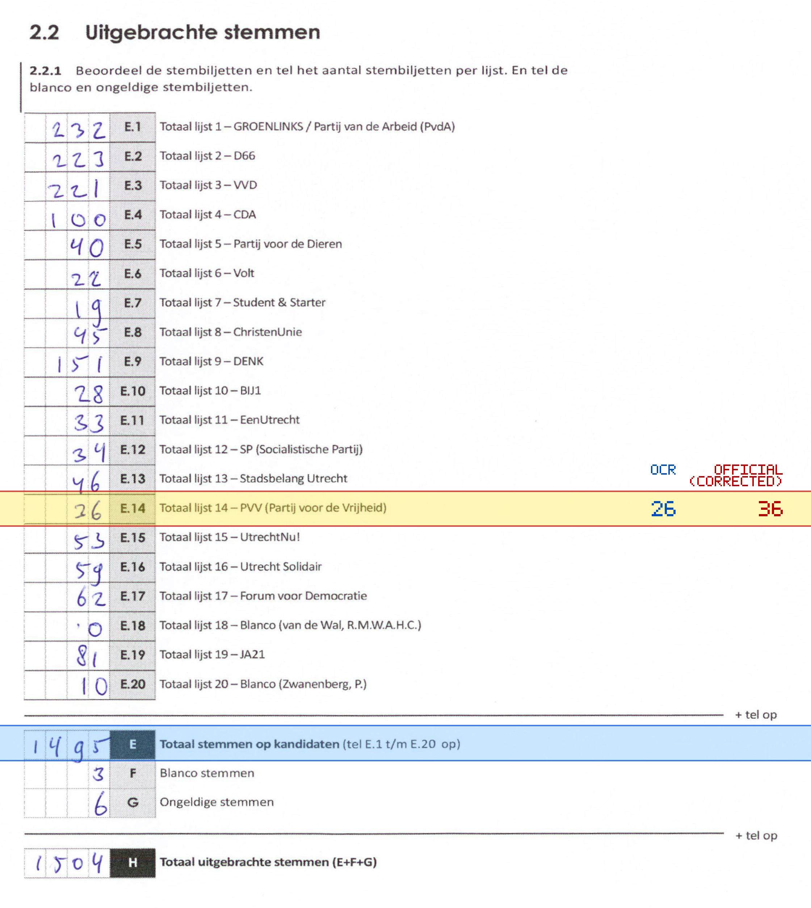
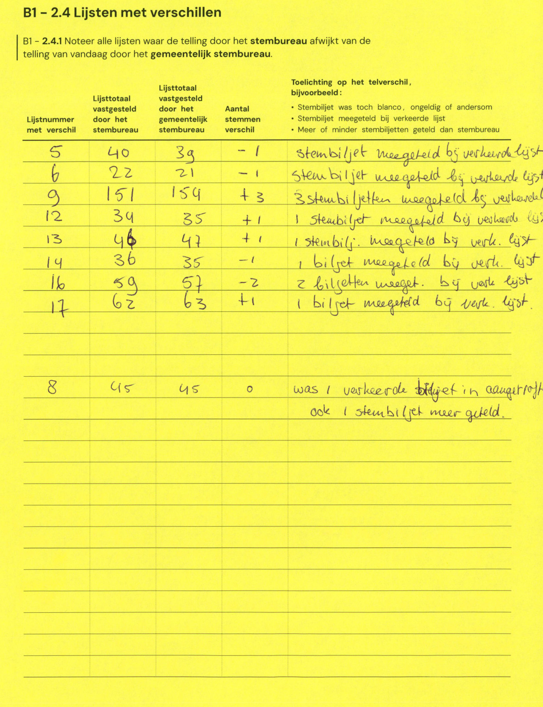

# Station 538 - Verlengde Houtrakgracht 598

- Status: `internally inconsistent`
- Markdown: `2026-GR/0344/results/Utrecht_538_Gymzaal_Verlengde_Houtrakgracht_GR26_eerste_telling.md`
- Correction OCR: `2026-GR/0344/results/corrections/Utrecht_538_Gymzaal_Verlengde_Houtrakgracht_GR26.md`

## Details

- E.1 through E.20 sum to 1485, but E is 1495
- E.14: md=26, official=36

## Candidate Votes

- Status: `incomplete`
- Compared candidate cells: 0/508
- Candidate OCR files: 0
- candidate OCR not available
- known list/correction issues are shown

Legend: yellow/red = official CSV mismatch; blue = internal consistency issue. The right margin shows OCR and official values for official mismatches.



## Corrections

```markdown
| ID | First | Second | Difference | Note |
|---|---:|---:|---:|---|
| E.5 | 40 | 39 | -1 | stembiljet meegeteld bij verkeerde lijst |
| E.6 | 22 | 21 | -1 | Stembiljet meegeteld bij verkeerde lijst |
| E.9 | 151 | 154 | 3 | 3 stembiljetten meegeteld bij verkeerde lijst |
| E.12 | 34 | 35 | 1 | 1 stembiljet meegeteld bij verkeerde lijst |
| E.13 | 46 | 47 | 1 | 1 stembiljet meegeteld bij verk. lijst |
| E.14 | 36 | 35 | -1 | 1 biljet meegeteld bij verk. lijst |
| E.16 | 59 | 57 | -2 | 2 biljetten meeget. bij verk. lijst |
| E.17 | 62 | 63 | 1 | 1 biljet meegeteld bij verk. lijst |
| E.8 | 45 | 45 | 0 | was 1 verkeerde biljet in aangeteld ook 1 stembiljet meer geteld |
```


