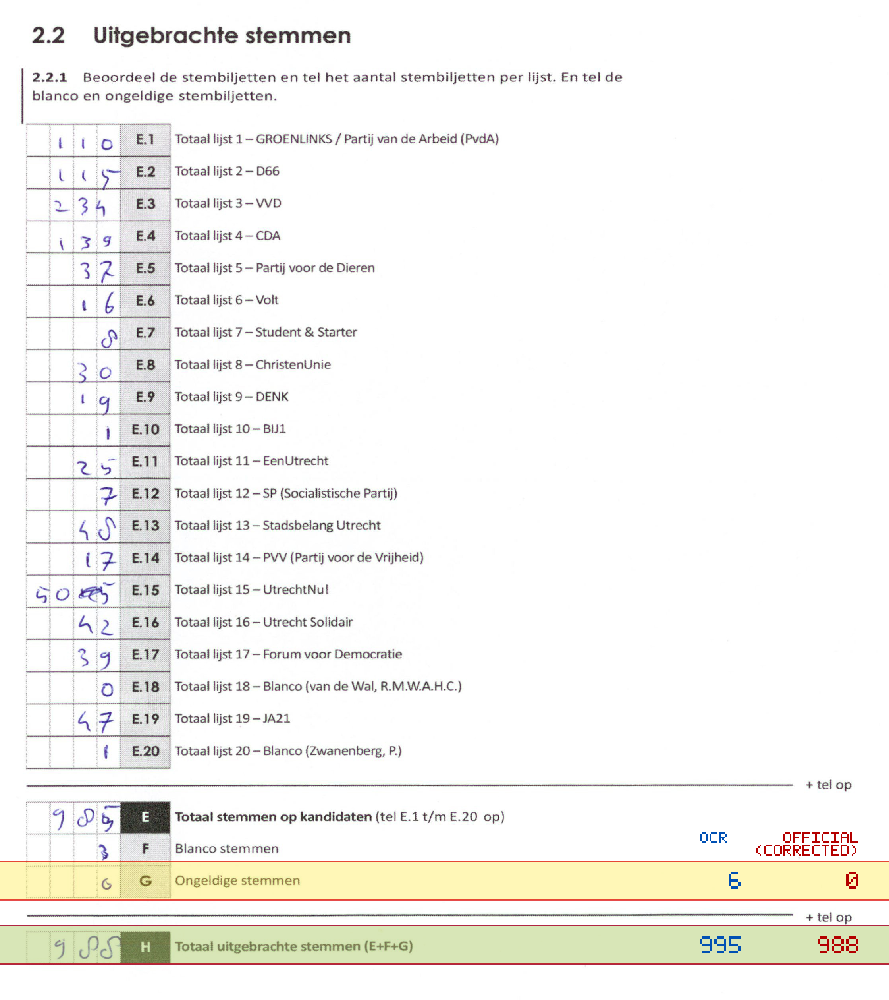
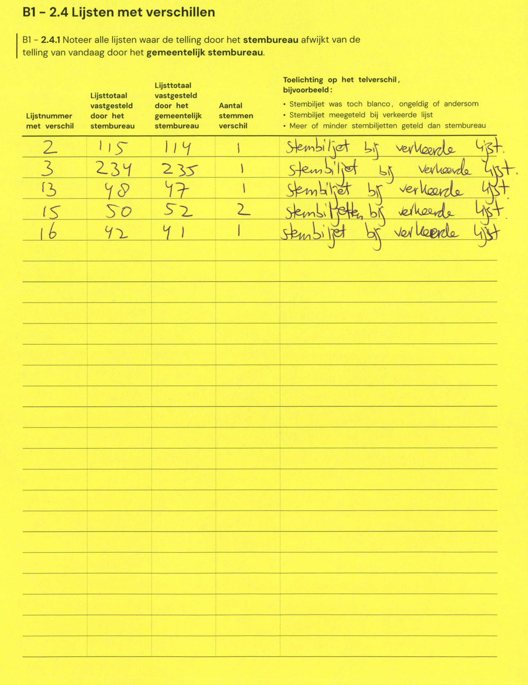

# Station 539 - Mereveldlaan 12

- Status: `internally inconsistent`
- Markdown: `2026-GR/0344/results/Utrecht_539_Marezaal_GR26_eerste_telling.md`
- Correction OCR: `2026-GR/0344/results/corrections/Utrecht_539_Marezaal_GR26.md`

## Details

- E + F + G is 994, but H is 995
- G: md=6, official=0
- H: md=995, official=988

## Candidate Votes

- Status: `incomplete`
- Compared candidate cells: 0/508
- Candidate OCR files: 0
- candidate OCR not available
- known list/correction issues are shown

Legend: yellow/red = official CSV mismatch; blue = internal consistency issue. The right margin shows OCR and official values for official mismatches.



## Corrections

```markdown
| ID | First | Second | Difference | Note |
|---|---:|---:|---:|---|
| E.2 | 115 | 114 | -1 | Stembiljet bij verkeerde lijst |
| E.3 | 234 | 235 | 1 | stembiljet bij verkeerde lijst |
| E.13 | 48 | 47 | -1 | stembiljet bij verkeerde lijst |
| E.15 | 50 | 52 | 2 | stembiljetten bij verkeerde lijst |
| E.16 | 42 | 41 | -1 | stembiljet bij verkeerde lijst |
```


