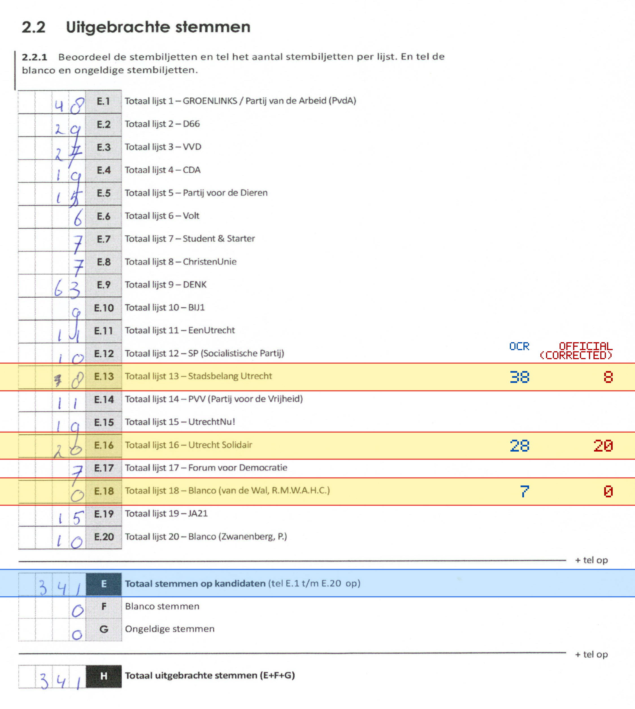
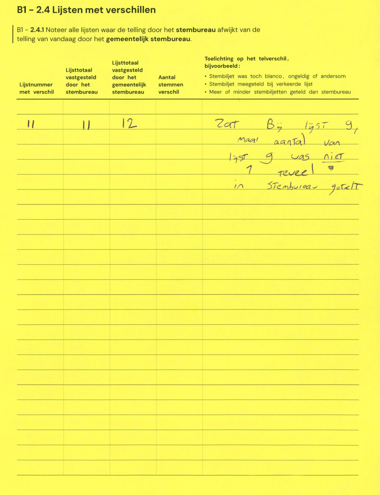

# Station 55 - Kretadreef 61 ingang via Kalymnosdreef

- Status: `internally inconsistent`
- Markdown: `2026-GR/0344/results/Utrecht_55_ROC_Midden_Nederland__locatie_Kretadreef__GR26_eerste_telling.md`
- Correction OCR: `2026-GR/0344/results/corrections/Utrecht_55_ROC_Midden_Nederland__locatie_Kretadreef__GR26.md`

## Details

- E.1 through E.20 sum to 386, but E is 341
- E.13: md=38, official=8
- E.16: md=28, official=20
- E.18: md=7, official=0

## Candidate Votes

- Status: `incomplete`
- Compared candidate cells: 0/508
- Candidate OCR files: 0
- candidate OCR not available
- known list/correction issues are shown

Legend: yellow/red = official CSV mismatch; blue = internal consistency issue. The right margin shows OCR and official values for official mismatches.



## Corrections

```markdown
| ID | First | Second | Difference | Note |
|---|---:|---:|---:|---|
| E.11 | 11 | 12 | 1 | Zat bij lijst 9, maar aantal van lijst 9 was niet 1 teveel in stembureau geteld |
```


