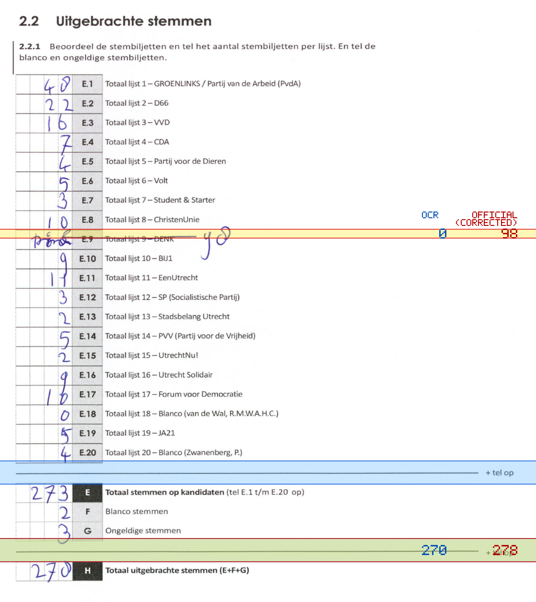
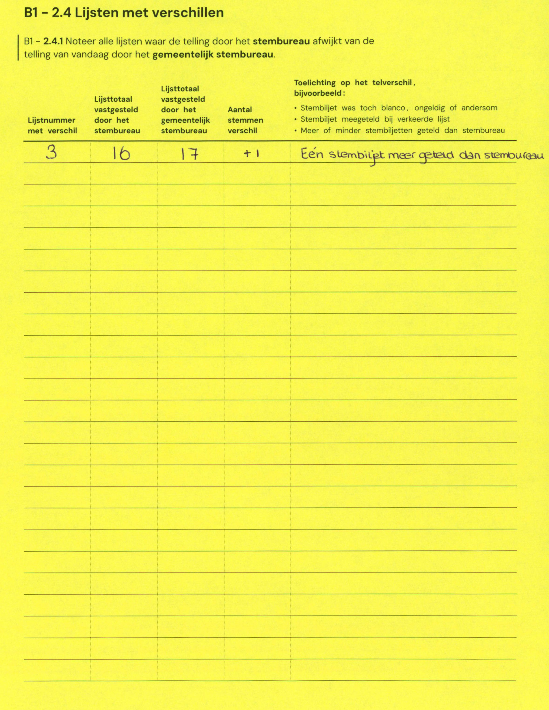

# Station 565 - Schooneggendreef 27C

- Status: `internally inconsistent`
- Markdown: `2026-GR/0344/results/Utrecht_565_Buurtcentrum_De_Dreef_GR26_eerste_telling.md`
- Correction OCR: `2026-GR/0344/results/corrections/Utrecht_565_Buurtcentrum_De_Dreef_GR26.md`

## Details

- E.1 through E.20 sum to 175, but E is 273
- E + F + G is 278, but H is 270
- E.9: md=0, official=98
- H: md=270, official=278

Legend: yellow/red = official CSV mismatch; blue = internal consistency issue. The right margin shows OCR and official values for official mismatches.



## Corrections

```markdown
| ID | First | Second | Difference | Note |
|---|---:|---:|---:|---|
| E.3 | 16 | 17 | 1 | Eén stembiljet meer geteld dan stembureau |
```


