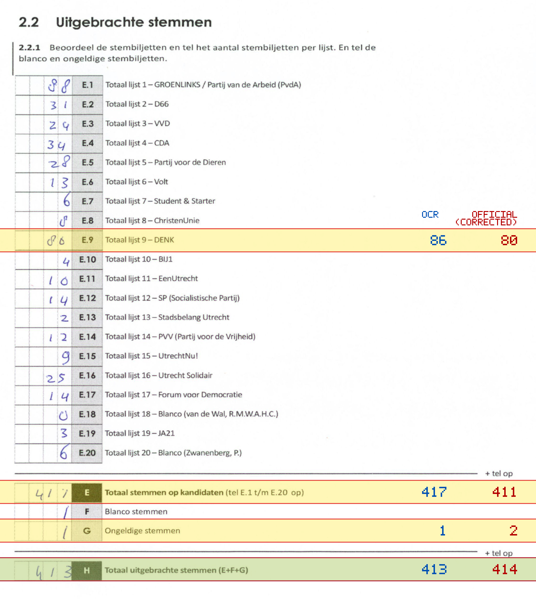
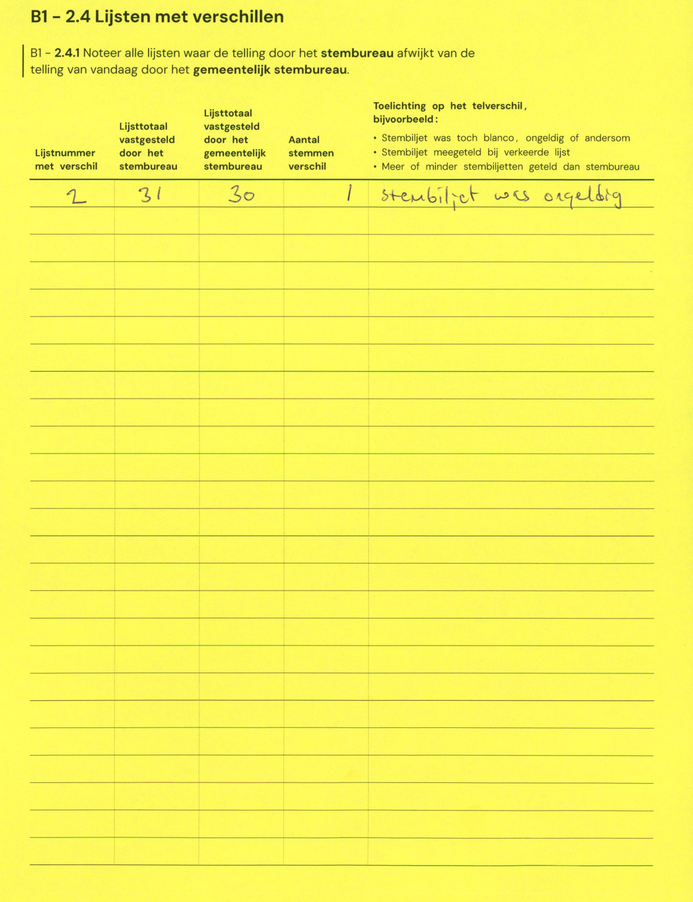

# Station 58 - Perudreef 8

- Status: `internally inconsistent`
- Markdown: `2026-GR/0344/results/Utrecht_58_Zorgcentrum_Zuylenstede_GR26_eerste_telling.md`
- Correction OCR: `2026-GR/0344/results/corrections/Utrecht_58_Zorgcentrum_Zuylenstede_GR26.md`

## Details

- E + F + G is 419, but H is 413
- E.9: md=86, official=80
- E: md=417, official=411
- G: md=1, official=2
- H: md=413, official=414

Legend: yellow/red = official CSV mismatch; blue = internal consistency issue. The right margin shows OCR and official values for official mismatches.



## Corrections

```markdown
| ID | First | Second | Difference | Note |
|---|---:|---:|---:|---|
| E.2 | 31 | 30 | -1 | stembiljet was ongeldig |
```


