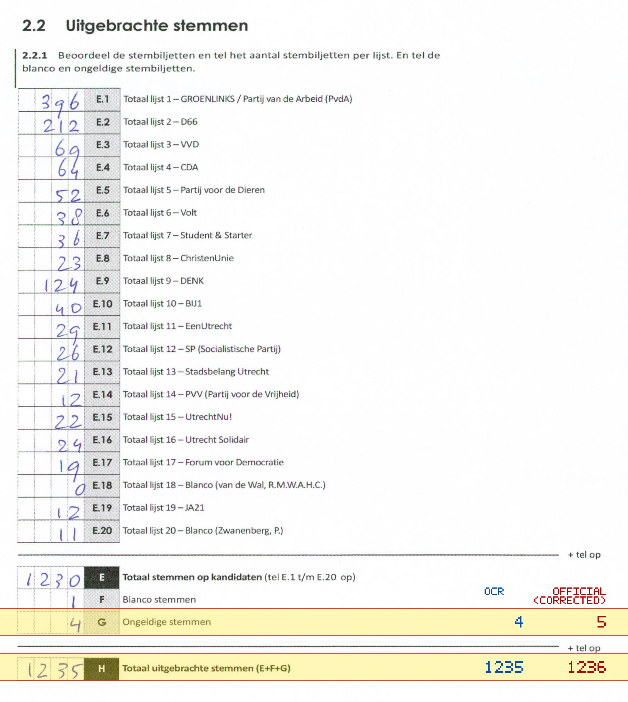
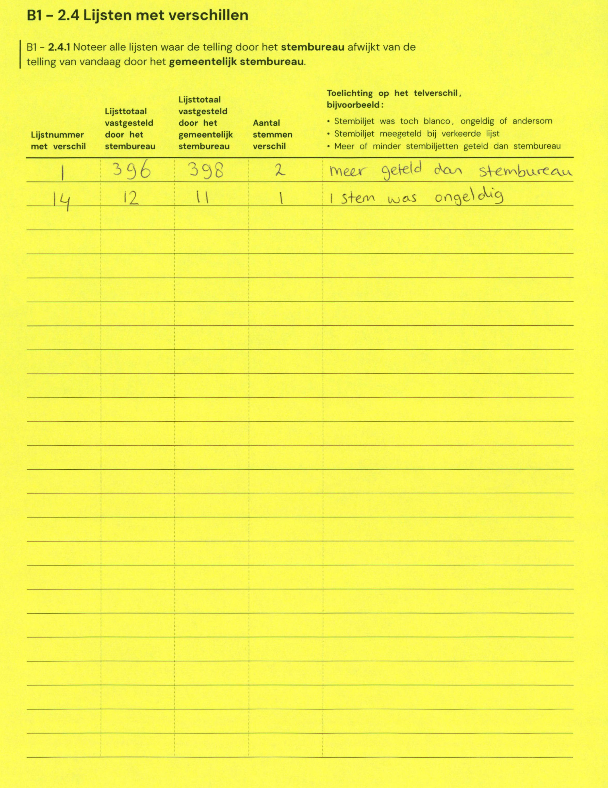

# Station 582 - 't Goylaan 77

- Status: `mismatch`
- Markdown: `2026-GR/0344/results/Utrecht_582_Buurtcentrum_Hart_van_Hoograven_GR26_eerste_telling.md`
- Correction OCR: `2026-GR/0344/results/corrections/Utrecht_582_Buurtcentrum_Hart_van_Hoograven_GR26.md`

## Details

- G: md=4, official=5
- H: md=1235, official=1236

Legend: yellow/red = official CSV mismatch; blue = internal consistency issue. The right margin shows OCR and official values for official mismatches.



## Corrections

```markdown
| ID | First | Second | Difference | Note |
|---|---:|---:|---:|---|
| E.1 | 396 | 398 | 2 | meer geteld dan stembureau |
| E.14 | 12 | 11 | -1 | 1 stem was ongeldig |
```


