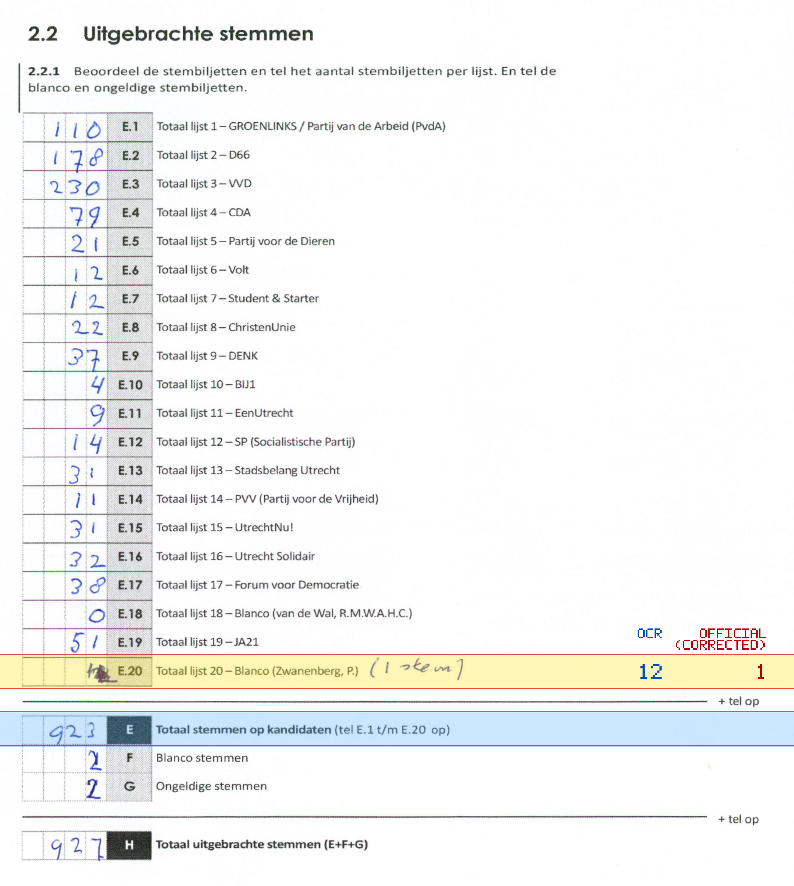
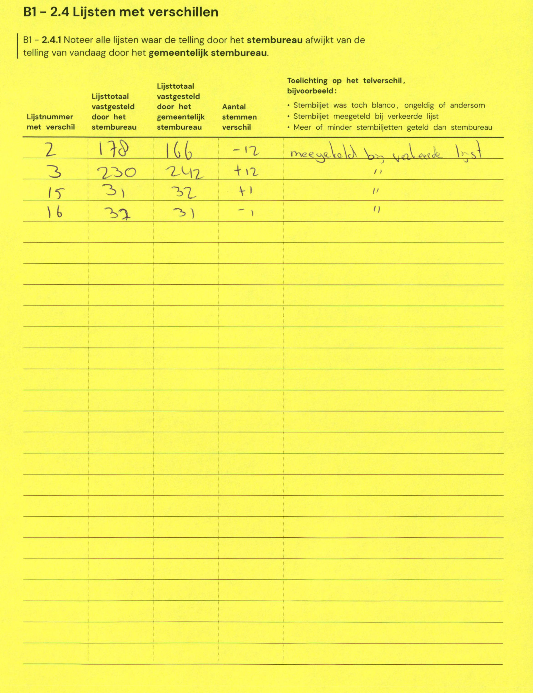

# Station 584 - Voor de Burchten 2

- Status: `internally inconsistent`
- Markdown: `2026-GR/0344/results/Utrecht_584_Sporthal_Cultuurcampus_GR26_eerste_telling.md`
- Correction OCR: `2026-GR/0344/results/corrections/Utrecht_584_Sporthal_Cultuurcampus_GR26.md`

## Details

- E.1 through E.20 sum to 934, but E is 923
- E.20: md=12, official=1

## Candidate Votes

- Status: `incomplete`
- Compared candidate cells: 0/508
- Candidate OCR files: 0
- candidate OCR not available
- known list/correction issues are shown

Legend: yellow/red = official CSV mismatch; blue = internal consistency issue. The right margin shows OCR and official values for official mismatches.



## Corrections

```markdown
| ID | First | Second | Difference | Note |
|---|---:|---:|---:|---|
| E.2 | 178 | 166 | -12 | meegerekend bij verkeerde lijst |
| E.3 | 230 | 242 | 12 | ,, |
| E.15 | 31 | 32 | 1 | ,, |
| E.16 | 32 | 31 | -1 | ,, |
```


