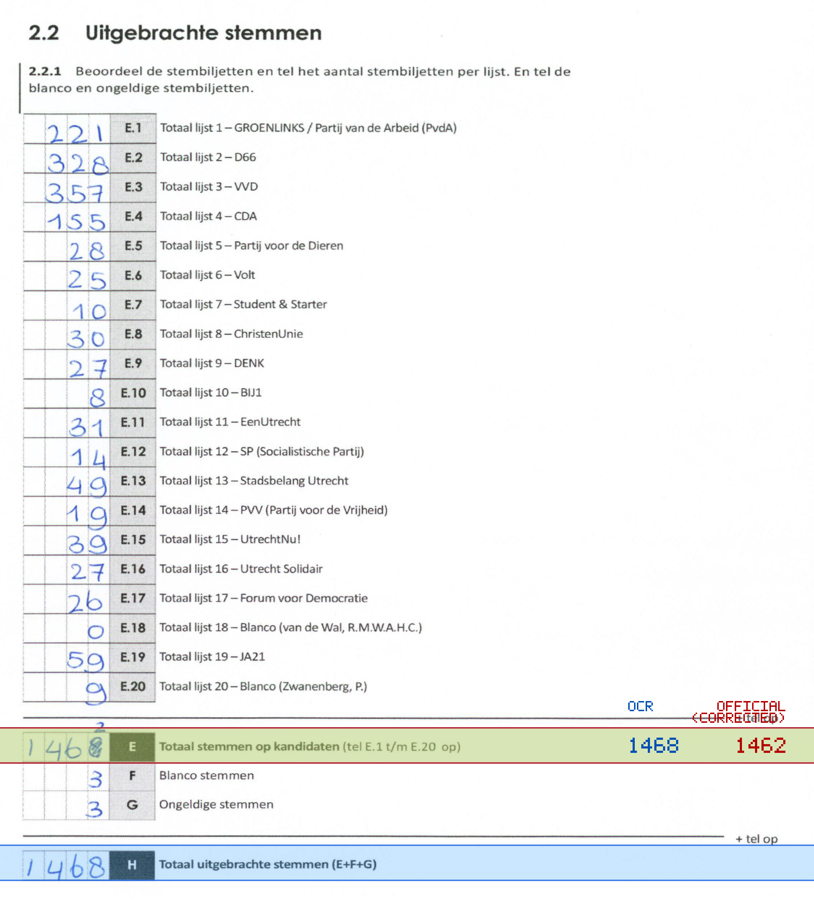
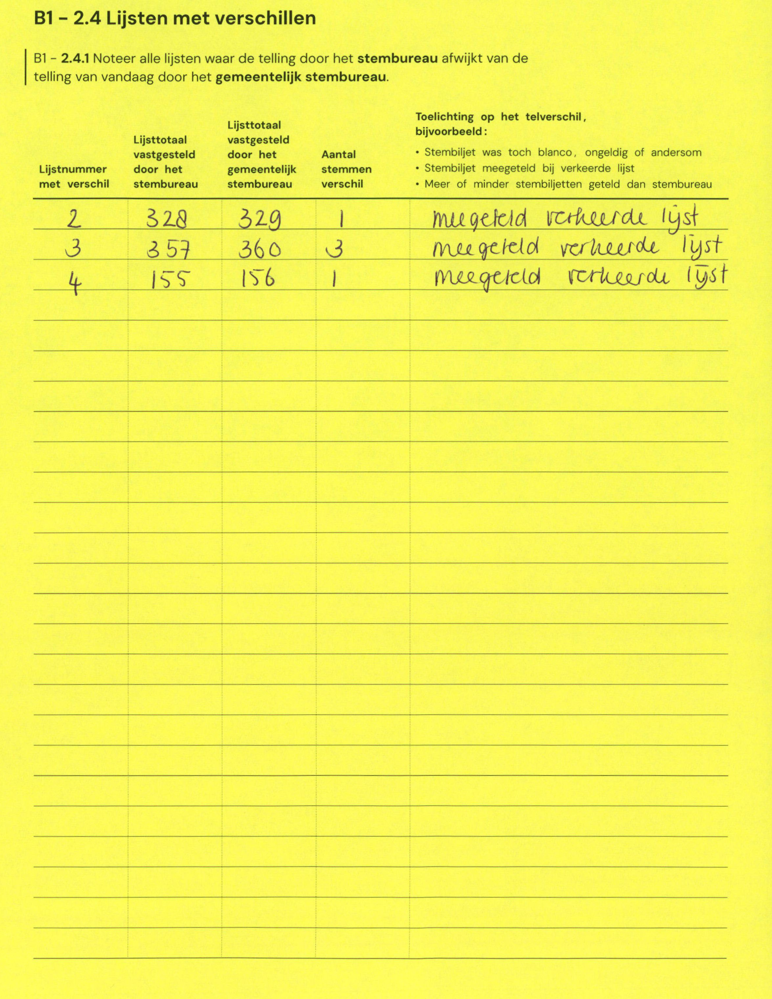

# Station 59 - Hoge Woerdplein 1

- Status: `internally inconsistent`
- Markdown: `2026-GR/0344/results/Utrecht_59_Castellum_Hoge_Woerd_GR26_eerste_telling.md`
- Correction OCR: `2026-GR/0344/results/corrections/Utrecht_59_Castellum_Hoge_Woerd_GR26.md`

## Details

- E.1 through E.20 sum to 1462, but E is 1468
- E + F + G is 1474, but H is 1468
- E: md=1468, official=1462

Legend: yellow/red = official CSV mismatch; blue = internal consistency issue. The right margin shows OCR and official values for official mismatches.



## Corrections

```markdown
| ID | First | Second | Difference | Note |
|---|---:|---:|---:|---|
| E.2 | 328 | 329 | 1 | meegeteld verkeerde lijst |
| E.3 | 357 | 360 | 3 | meegeteld verkeerde lijst |
| E.4 | 155 | 156 | 1 | meegeteld verkeerde lijst |
```


