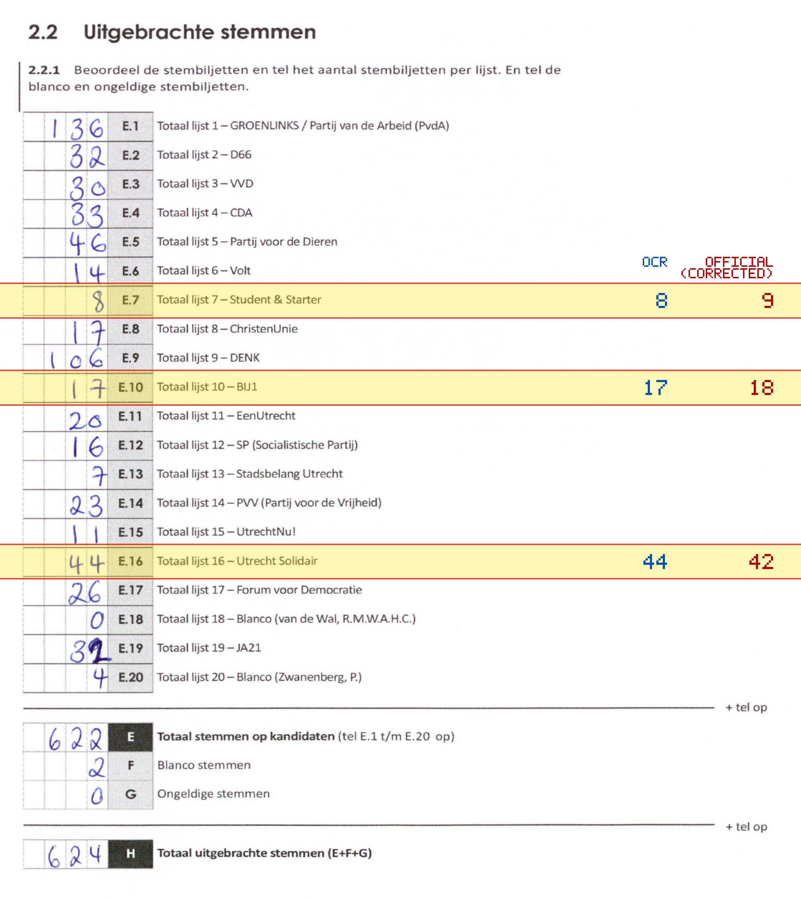
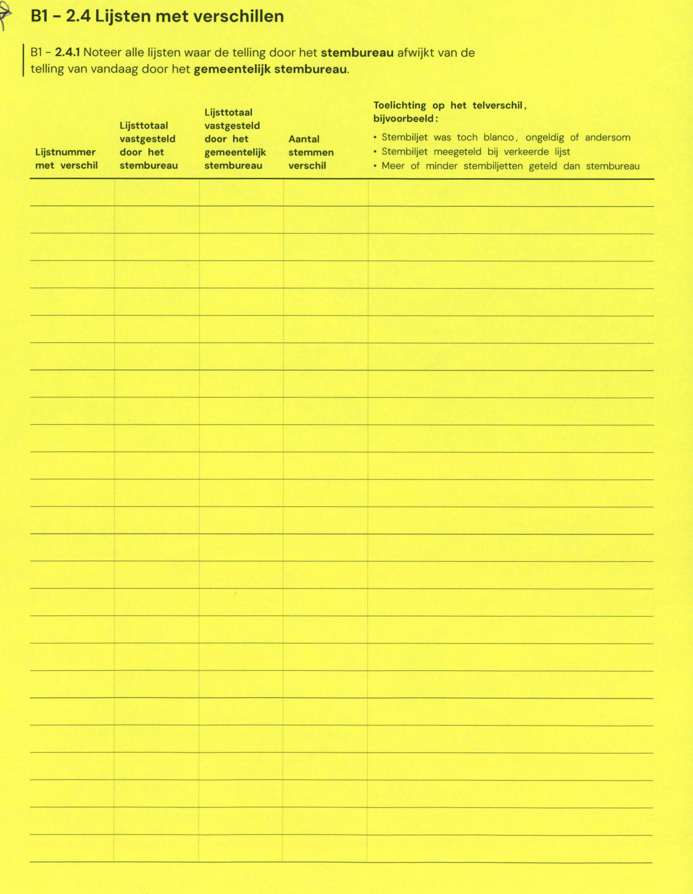

# Station 60 - Costa Ricadreef 9

- Status: `mismatch`
- Markdown: `2026-GR/0344/results/Utrecht_60_Woonzorgcentrum__t_Huis_aan_de_Vecht_GR26_eerste_telling.md`
- Correction OCR: `2026-GR/0344/results/corrections/Utrecht_60_Woonzorgcentrum__t_Huis_aan_de_Vecht_GR26.md`

## Details

- E.7: md=8, official=9
- E.10: md=17, official=18
- E.16: md=44, official=42

## Candidate Votes

- Status: `incomplete`
- Compared candidate cells: 0/508
- Candidate OCR files: 0
- candidate OCR not available
- known list/correction issues are shown

Legend: yellow/red = official CSV mismatch; blue = internal consistency issue. The right margin shows OCR and official values for official mismatches.



## Corrections

```markdown
| ID | First | Second | Difference | Note |
|---|---:|---:|---:|---|
```


