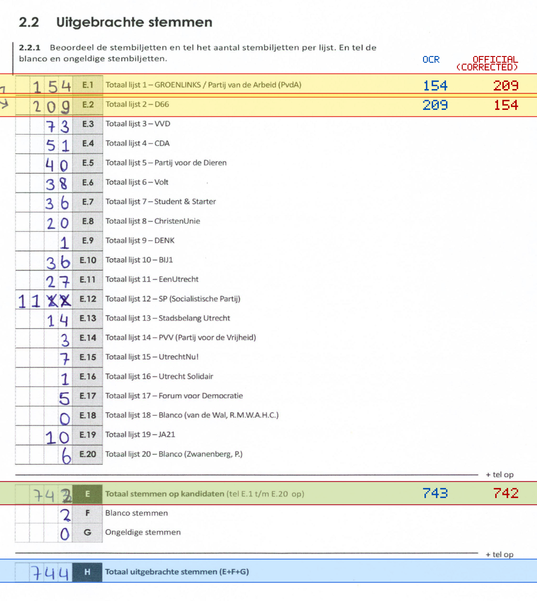
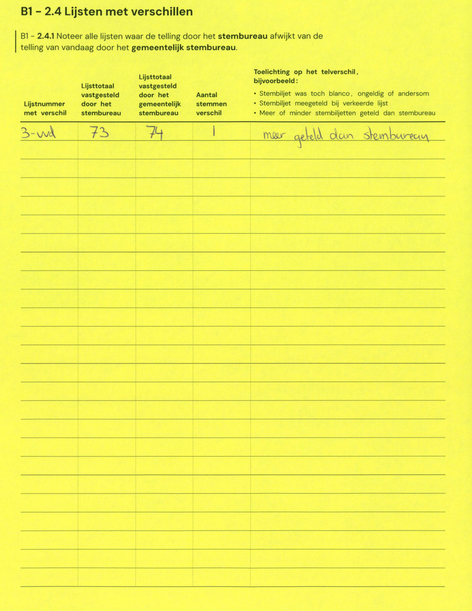

# Station 601 - Pieterskerkhof 10  ingang t.o. Kromme Nieuwegracht nr. 60

- Status: `internally inconsistent`
- Markdown: `2026-GR/0344/results/Utrecht_601_Gymzaal_Pieterskerkhof_GR26_eerste_telling.md`
- Correction OCR: `2026-GR/0344/results/corrections/Utrecht_601_Gymzaal_Pieterskerkhof_GR26.md`

## Details

- E.1 through E.20 sum to 742, but E is 743
- E + F + G is 745, but H is 744
- E.1: md=154, official=209
- E.2: md=209, official=154
- E: md=743, official=742

Legend: yellow/red = official CSV mismatch; blue = internal consistency issue. The right margin shows OCR and official values for official mismatches.



## Corrections

```markdown
| ID | First | Second | Difference | Note |
|---|---:|---:|---:|---|
| E.3 | 73 | 74 | 1 | meer geteld dan stembureau |
```


