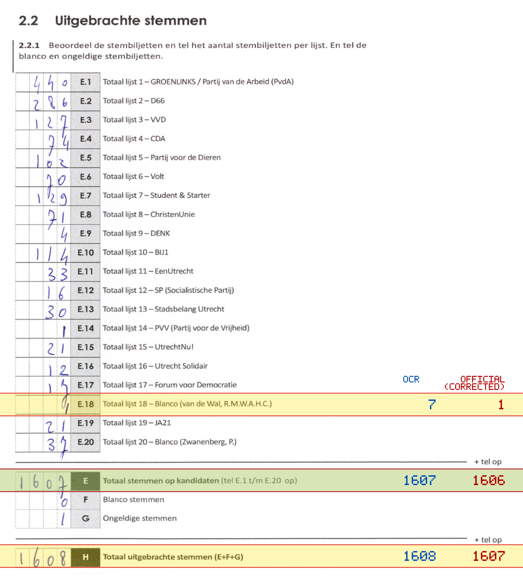
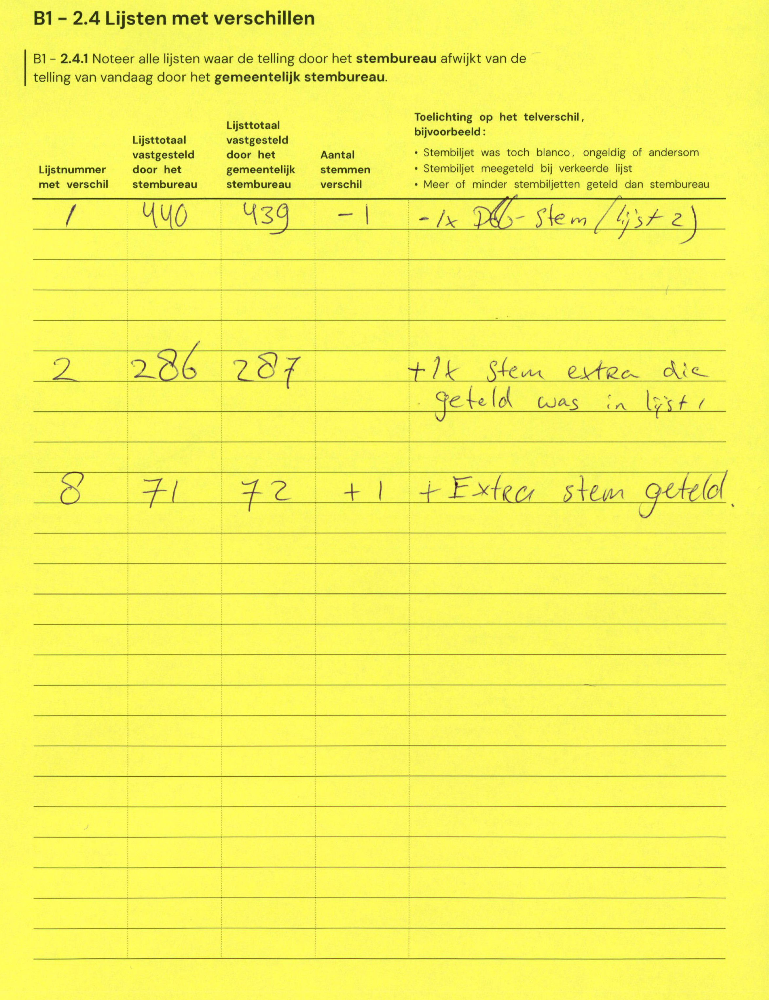

# Station 608 - Achter de Dom 1 ingang via hoofdingang Domplein 31

- Status: `internally inconsistent`
- Markdown: `2026-GR/0344/results/Utrecht_608_Domkerk_GR26_eerste_telling.md`
- Correction OCR: `2026-GR/0344/results/corrections/Utrecht_608_Domkerk_GR26.md`

## Details

- E.1 through E.20 sum to 1612, but E is 1607
- E.18: md=7, official=1
- E: md=1607, official=1606
- H: md=1608, official=1607

## Candidate Votes

- Status: `incomplete`
- Compared candidate cells: 0/508
- Candidate OCR files: 0
- candidate OCR not available
- known list/correction issues are shown

Legend: yellow/red = official CSV mismatch; blue = internal consistency issue. The right margin shows OCR and official values for official mismatches.



## Corrections

```markdown
| ID | First | Second | Difference | Note |
|---|---:|---:|---:|---|
| E.1 | 440 | 439 | -1 | -1x PvdA-stem/lijst 2) |
| E.2 | 286 | 287 | 1 | +1k stem extra die geteld was in lijst 1 |
| E.8 | 71 | 72 | 1 | +Extra stem geteld |
```


