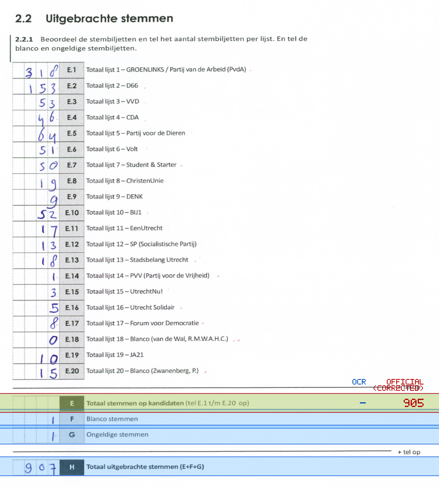
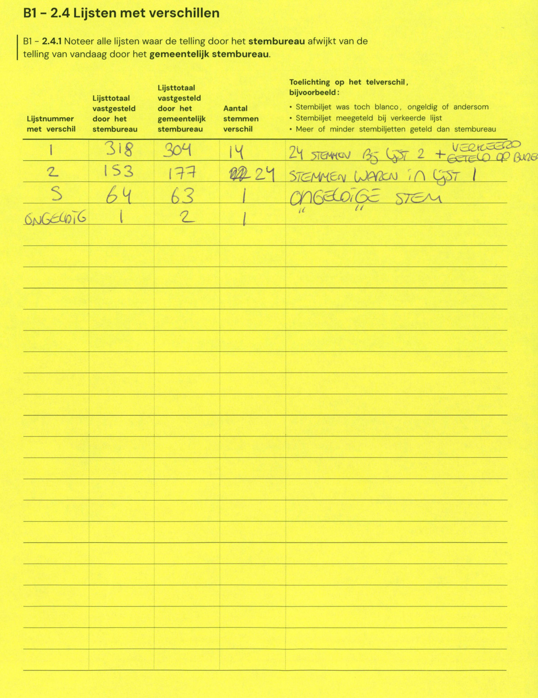

# Station 611 - Stationshal 9  Zaal 7 Spoorpaviljoen

- Status: `internally inconsistent`
- Markdown: `2026-GR/0344/results/Utrecht_611_Bar_Beton_GR26_eerste_telling.md`
- Correction OCR: `2026-GR/0344/results/corrections/Utrecht_611_Bar_Beton_GR26.md`

## Details

- expected 26 non-empty table lines, found 25
- row 23 expected ID E, found F
- row 24 expected ID F, found G
- row 25 expected ID G, found H
- missing row 26 for H
- E: md=missing, official=905

Legend: yellow/red = official CSV mismatch; blue = internal consistency issue. The right margin shows OCR and official values for official mismatches.



## Corrections

```markdown
| ID | First | Second | Difference | Note |
|---|---:|---:|---:|---|
| E.1 | 318 | 304 | -14 | 24 STEMMEN BJ LIST 2 + GETELD OP BUREAU |
| E.2 | 153 | 177 | 24 | 24 STEMMEN WAREN IN LIST 1 |
| E.5 | 64 | 63 | -1 | |
| G | 1 | 2 | 1 | ONGELDIGE STEM |
```


