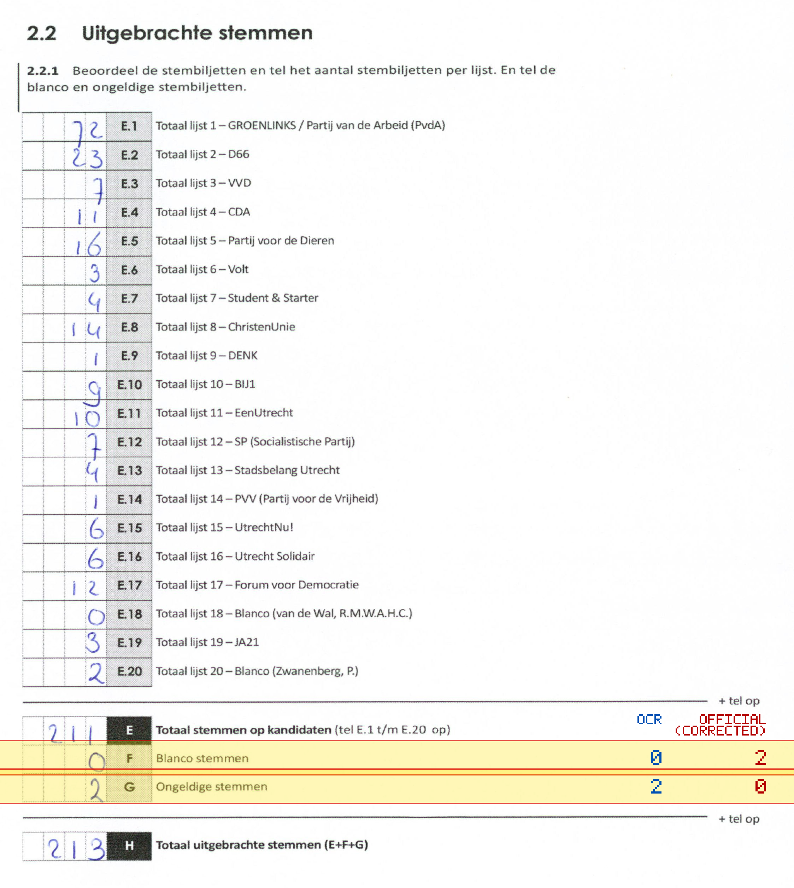
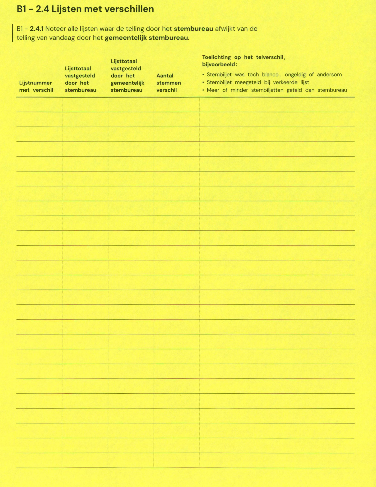

# Station 614 - Zwarte Woud 211

- Status: `mismatch`
- Markdown: `2026-GR/0344/results/Utrecht_614_De_Passie_GR26_eerste_telling.md`
- Correction OCR: `2026-GR/0344/results/corrections/Utrecht_614_De_Passie_GR26.md`

## Details

- F: md=0, official=2
- G: md=2, official=0

## Candidate Votes

- Status: `incomplete`
- Compared candidate cells: 0/508
- Candidate OCR files: 0
- candidate OCR not available
- known list/correction issues are shown

Legend: yellow/red = official CSV mismatch; blue = internal consistency issue. The right margin shows OCR and official values for official mismatches.



## Corrections

```markdown
| ID | First | Second | Difference | Note |
|---|---:|---:|---:|---|
```


