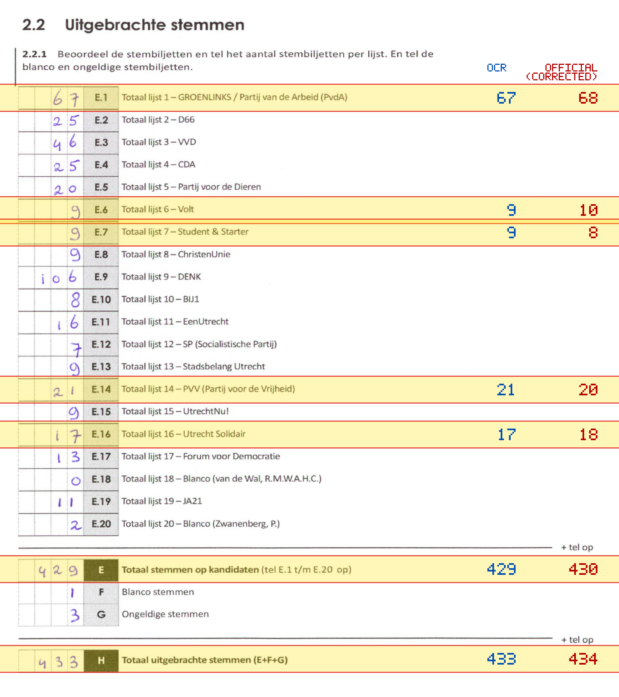
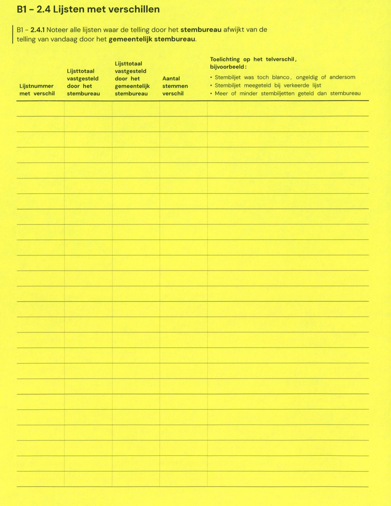

# Station 62 - Indusdreef 5

- Status: `mismatch`
- Markdown: `2026-GR/0344/results/Utrecht_62_Verpleeghuis_Rosendael_GR26_eerste_telling.md`
- Correction OCR: `2026-GR/0344/results/corrections/Utrecht_62_Verpleeghuis_Rosendael_GR26.md`

## Details

- E.1: md=67, official=68
- E.6: md=9, official=10
- E.7: md=9, official=8
- E.14: md=21, official=20
- E.16: md=17, official=18
- E: md=429, official=430
- H: md=433, official=434

## Candidate Votes

- Status: `incomplete`
- Compared candidate cells: 0/508
- Candidate OCR files: 0
- candidate OCR not available
- known list/correction issues are shown

Legend: yellow/red = official CSV mismatch; blue = internal consistency issue. The right margin shows OCR and official values for official mismatches.



## Corrections

```markdown
| ID | First | Second | Difference | Note |
|---|---:|---:|---:|---|
```


