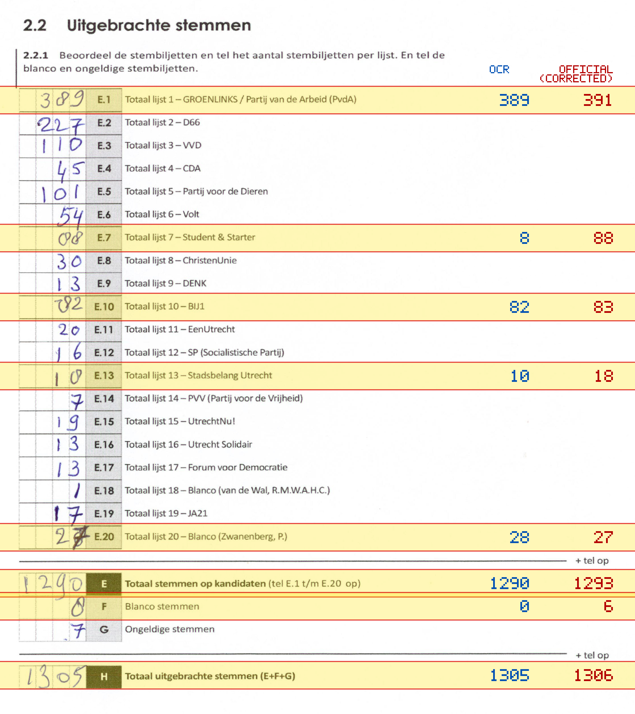
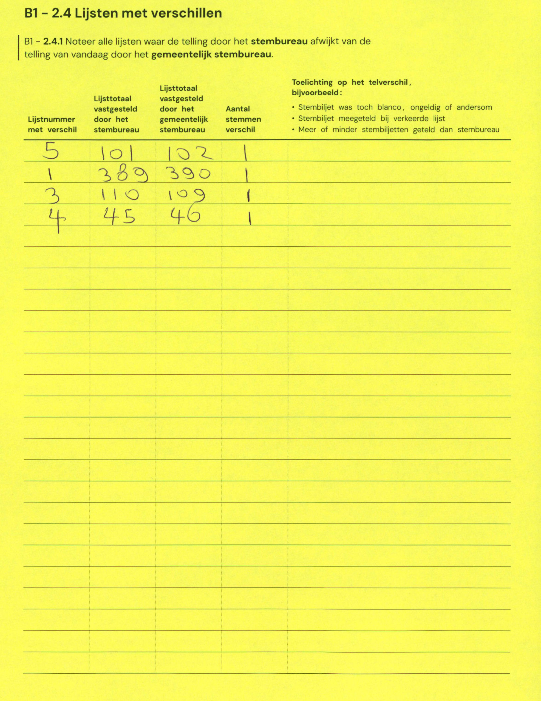

# Station 629 - Neude 11

- Status: `correction inconsistent`
- Markdown: `2026-GR/0344/results/Utrecht_629_Bibliotheek_Neude_GR26_eerste_telling.md`
- Correction OCR: `2026-GR/0344/results/corrections/Utrecht_629_Bibliotheek_Neude_GR26.md`

## Correction Inconsistency

The correction table does not line up with the first-count Markdown. Inspect the correction crop before treating this as a plain official-result mismatch.


## Details

- could not apply corrections: E.1 second=390, official=391

## Candidate Votes

- Status: `incomplete`
- Compared candidate cells: 0/508
- Candidate OCR files: 0
- candidate OCR not available
- known list/correction issues are shown

Legend: yellow/red = official CSV mismatch; blue = internal consistency issue. The right margin shows OCR and official values for official mismatches.



## Corrections

```markdown
| ID | First | Second | Difference | Note |
|---|---:|---:|---:|---|
| E.5 | 101 | 102 | 1 |  |
| E.1 | 389 | 390 | 1 |  |
| E.3 | 110 | 109 | -1 |  |
| E.4 | 45 | 46 | 1 |  |
```


