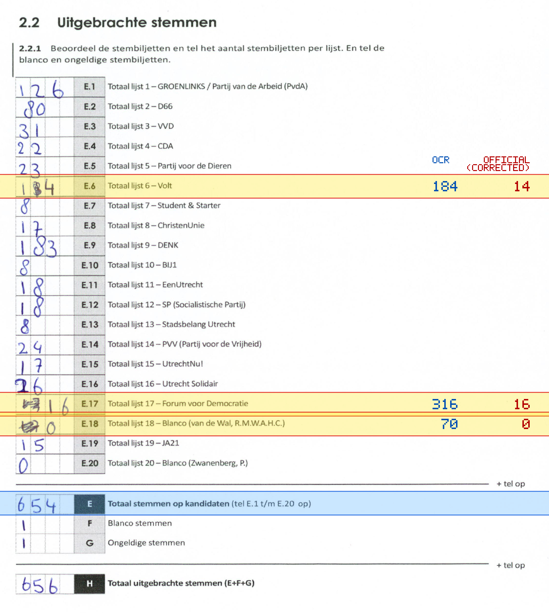
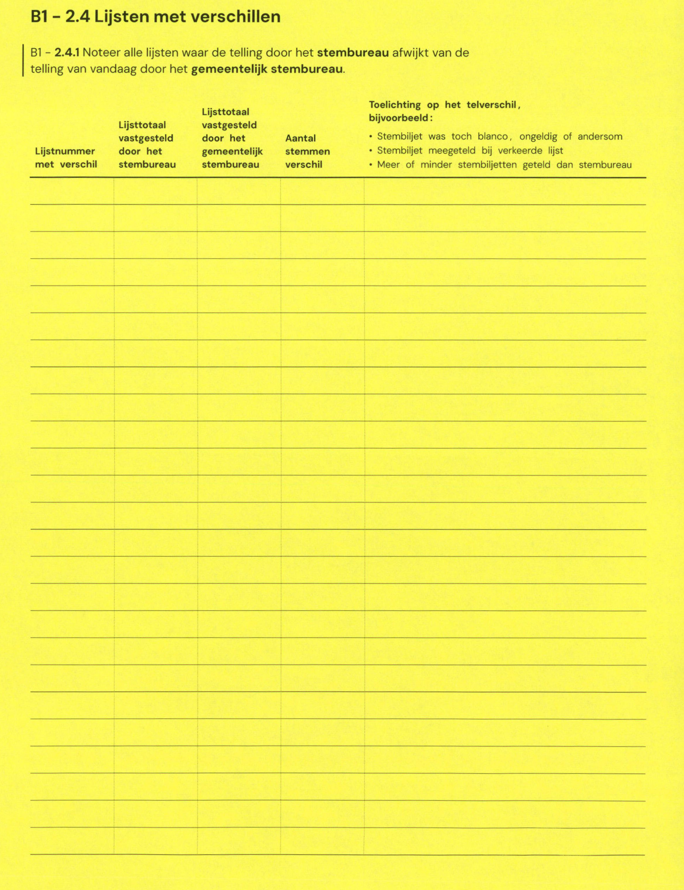

# Station 631 - Jeanne d'Arcdreef 1

- Status: `internally inconsistent`
- Markdown: `2026-GR/0344/results/Utrecht_631_Burezina_GR26_eerste_telling.md`
- Correction OCR: `2026-GR/0344/results/corrections/Utrecht_631_Burezina_GR26.md`

## Details

- E.1 through E.20 sum to 1194, but E is 654
- E.6: md=184, official=14
- E.17: md=316, official=16
- E.18: md=70, official=0

Legend: yellow/red = official CSV mismatch; blue = internal consistency issue. The right margin shows OCR and official values for official mismatches.



## Corrections

```markdown
| ID | First | Second | Difference | Note |
|---|---:|---:|---:|---|
```


