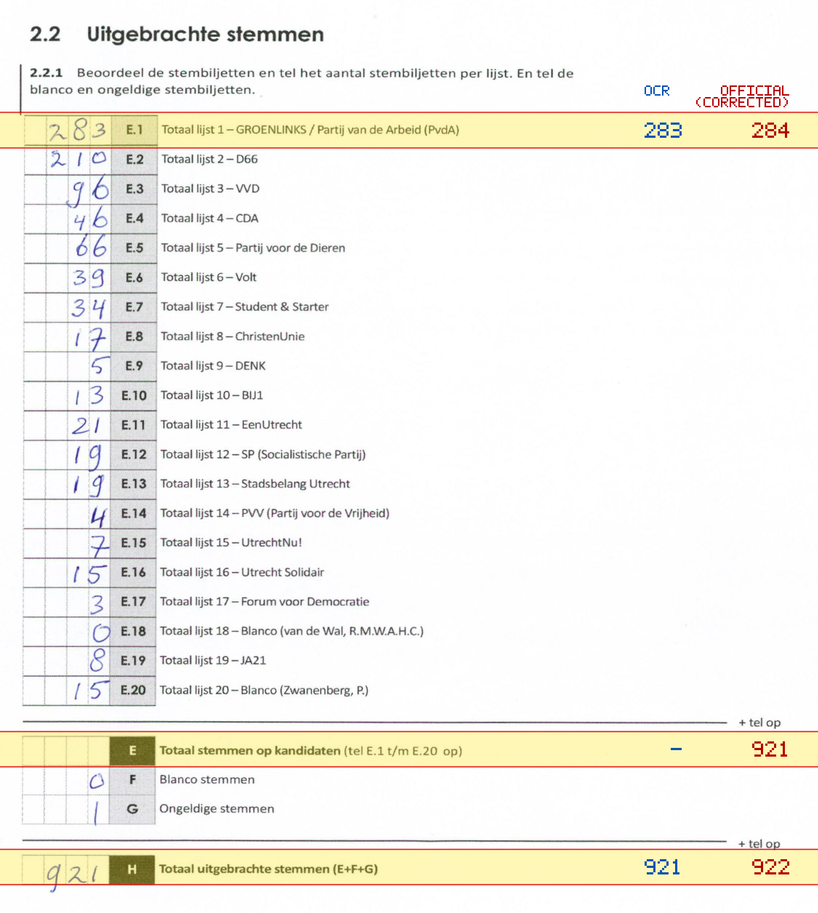
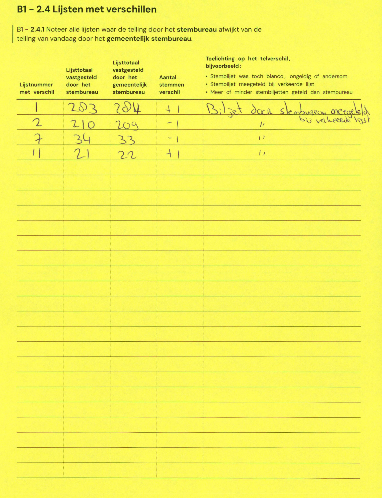

# Station 634 - Mecklenburglaan 3

- Status: `correction inconsistent`
- Markdown: `2026-GR/0344/results/Utrecht_634_De_Wilg_GR26_eerste_telling.md`
- Correction OCR: `2026-GR/0344/results/corrections/Utrecht_634_De_Wilg_GR26.md`

## Correction Inconsistency

The correction table does not line up with the first-count Markdown. Inspect the correction crop before treating this as a plain official-result mismatch.


## Details

- could not apply corrections: E.1 second=204, official=284

Legend: yellow/red = official CSV mismatch; blue = internal consistency issue. The right margin shows OCR and official values for official mismatches.



## Corrections

```markdown
| ID | First | Second | Difference | Note |
|---|---:|---:|---:|---|
| E.1 | 203 | 204 | +1 | Biljet door stembureau meegelegd bij verkeerde lijst |
| E.2 | 210 | 209 | -1 | ,, |
| E.7 | 34 | 33 | -1 | ,, |
| E.11 | 21 | 22 | +1 | ,, |
```


