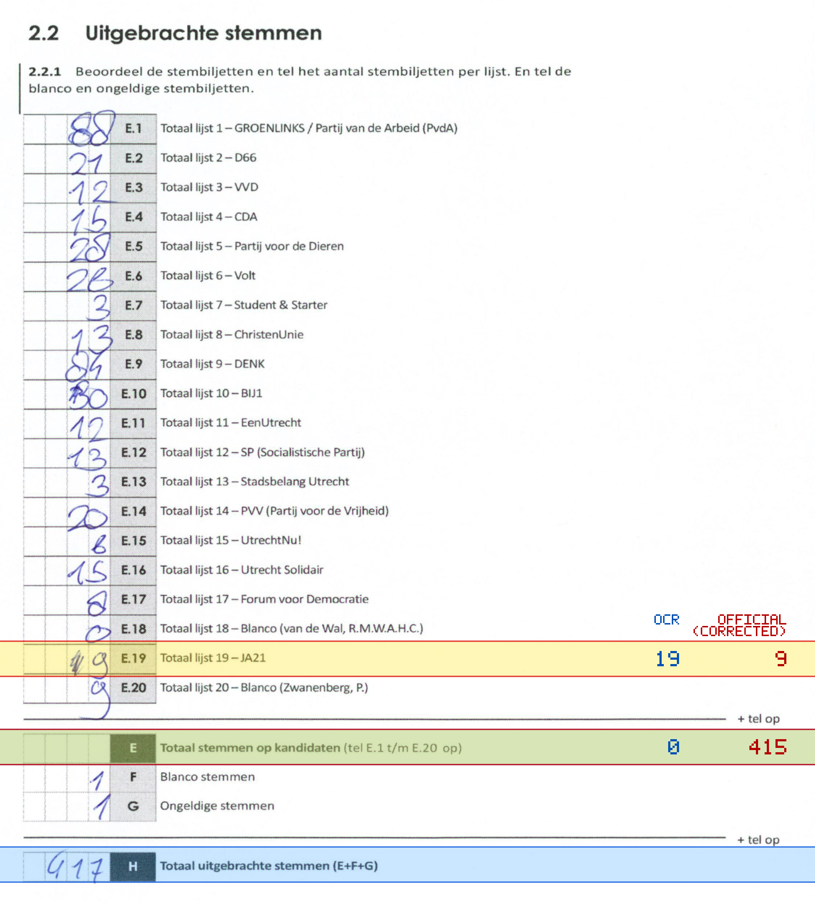
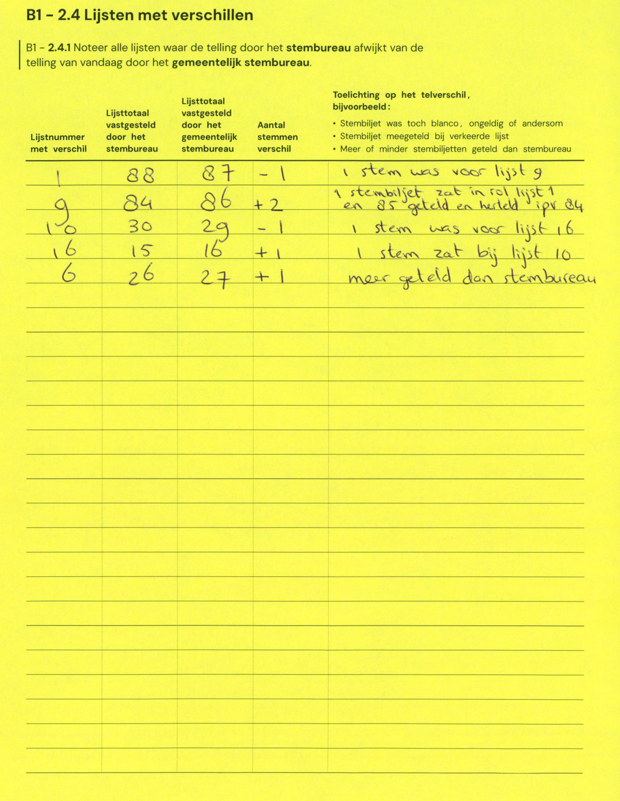

# Station 635 - Braziliëdreef 2

- Status: `internally inconsistent`
- Markdown: `2026-GR/0344/results/Utrecht_635_Zimihc_Stefanus_GR26_eerste_telling__1_.md`
- Correction OCR: `2026-GR/0344/results/corrections/Utrecht_635_Zimihc_Stefanus_GR26.md`

## Details

- E.1 through E.20 sum to 425, but E is 0
- E + F + G is 2, but H is 417
- E.19: md=19, official=9
- E: md=0, official=415

## Candidate Votes

- Status: `incomplete`
- Compared candidate cells: 0/508
- Candidate OCR files: 0
- candidate OCR not available
- known list/correction issues are shown

Legend: yellow/red = official CSV mismatch; blue = internal consistency issue. The right margin shows OCR and official values for official mismatches.



## Corrections

```markdown
| ID | First | Second | Difference | Note |
|---|---:|---:|---:|---|
| E.1 | 88 | 87 | -1 | 1 stem was voor lijst 9 |
| E.9 | 84 | 86 | 2 | 1 stembiljet zat in rol lijst 1 en 85 geteld en hereld ipv 84 |
| E.10 | 30 | 29 | -1 | 1 stem was voor lijst 16 |
| E.16 | 15 | 16 | 1 | 1 stem zat bij lijst 10 |
| E.6 | 26 | 27 | 1 | meer geteld dan stembureau |
```


