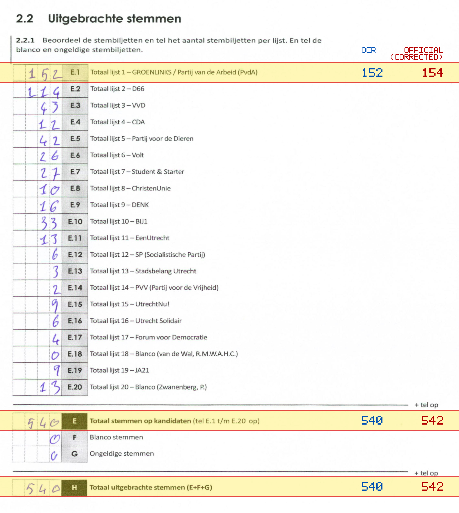
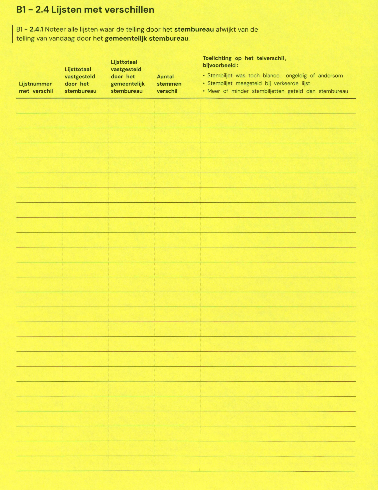

# Station 641 - Europalaan 2B

- Status: `mismatch`
- Markdown: `2026-GR/0344/results/Utrecht_641_Vechtclub_XL_GR26_eerste_telling.md`
- Correction OCR: `2026-GR/0344/results/corrections/Utrecht_641_Vechtclub_XL_GR26.md`

## Details

- E.1: md=152, official=154
- E: md=540, official=542
- H: md=540, official=542

Legend: yellow/red = official CSV mismatch; blue = internal consistency issue. The right margin shows OCR and official values for official mismatches.



## Corrections

```markdown
| ID | First | Second | Difference | Note |
|---|---:|---:|---:|---|
```


