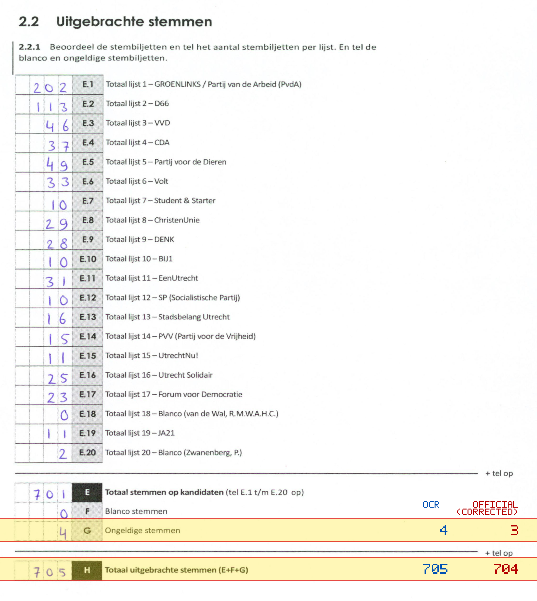
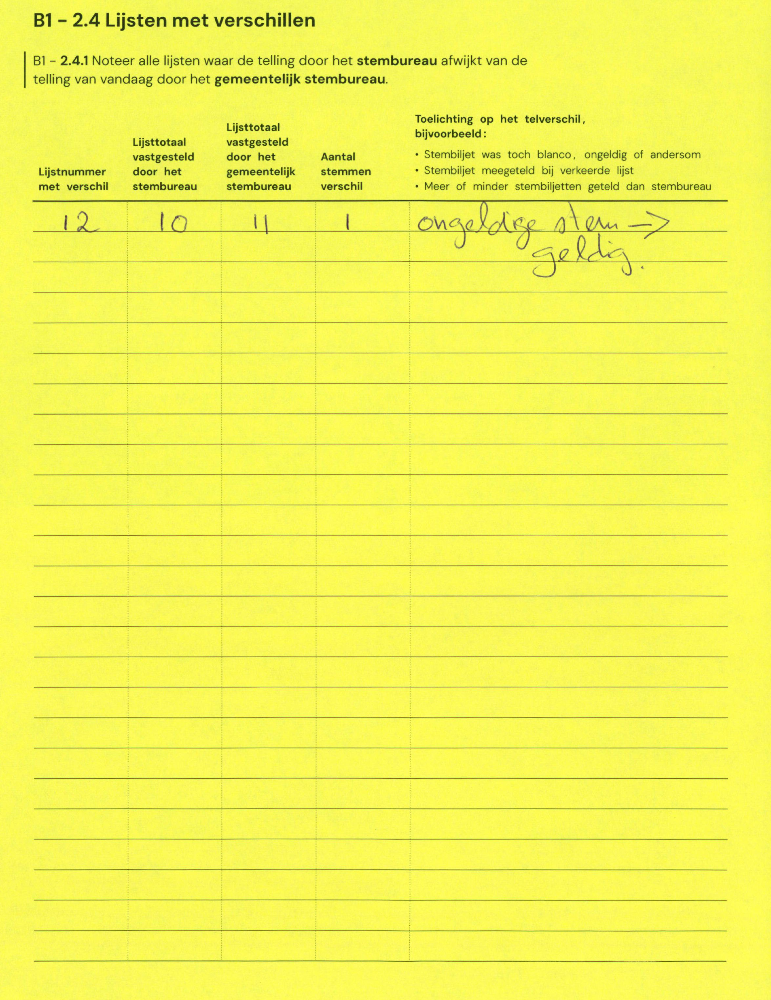

# Station 649 - Burg Norbruislaan 17

- Status: `mismatch`
- Markdown: `2026-GR/0344/results/Utrecht_649_Parel_van_Zuilen_GR26_eerste_telling.md`
- Correction OCR: `2026-GR/0344/results/corrections/Utrecht_649_Parel_van_Zuilen_GR26.md`

## Details

- G: md=4, official=3
- H: md=705, official=704

Legend: yellow/red = official CSV mismatch; blue = internal consistency issue. The right margin shows OCR and official values for official mismatches.



## Corrections

```markdown
| ID | First | Second | Difference | Note |
|---|---:|---:|---:|---|
| E.12 | 10 | 11 | 1 | ongeldige stem -> geldig |
```


