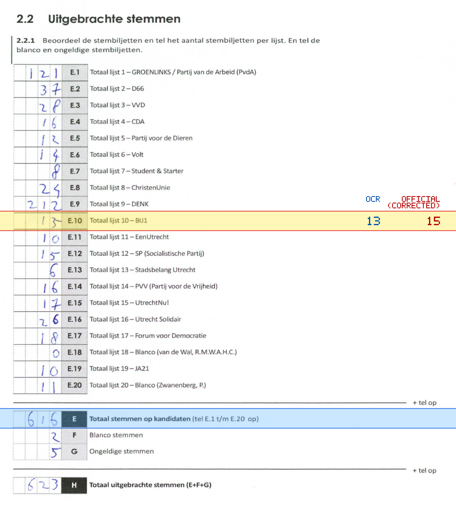
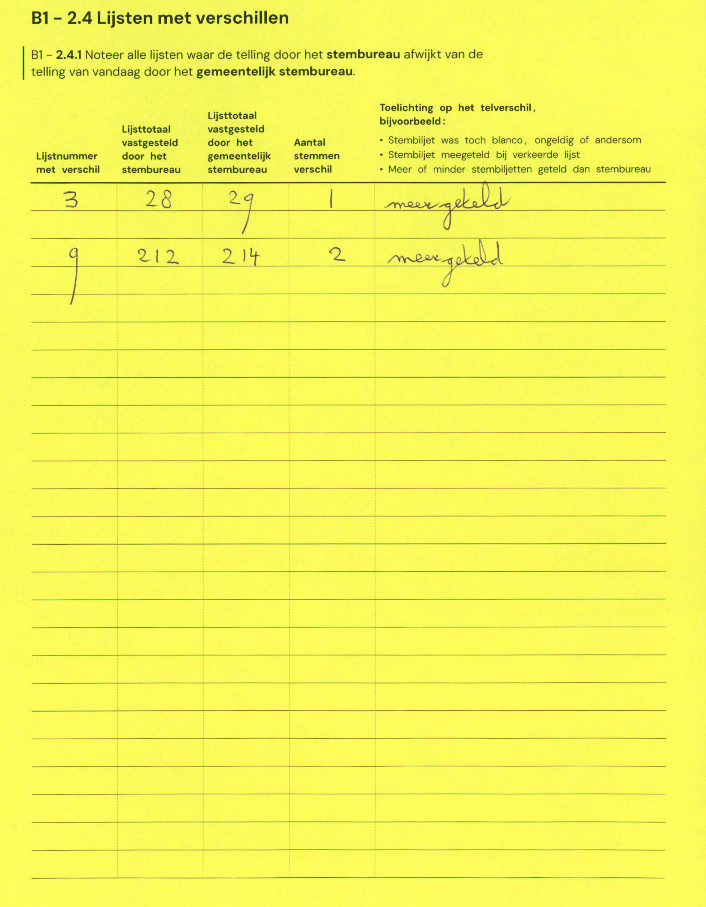

# Station 65 - Nigerdreef 8 ingang via hoek Bantoedreef/Nigerdreef

- Status: `internally inconsistent`
- Markdown: `2026-GR/0344/results/Utrecht_65_KBS_Mattheus_GR26_eerste_telling.md`
- Correction OCR: `2026-GR/0344/results/corrections/Utrecht_65_KBS_Mattheus_GR26.md`

## Details

- E.1 through E.20 sum to 614, but E is 616
- E.10: md=13, official=15

Legend: yellow/red = official CSV mismatch; blue = internal consistency issue. The right margin shows OCR and official values for official mismatches.



## Corrections

```markdown
| ID | First | Second | Difference | Note |
|---|---:|---:|---:|---|
| E.3 | 28 | 29 | 1 | meer geteld |
| E.9 | 212 | 214 | 2 | meer geteld |
```


