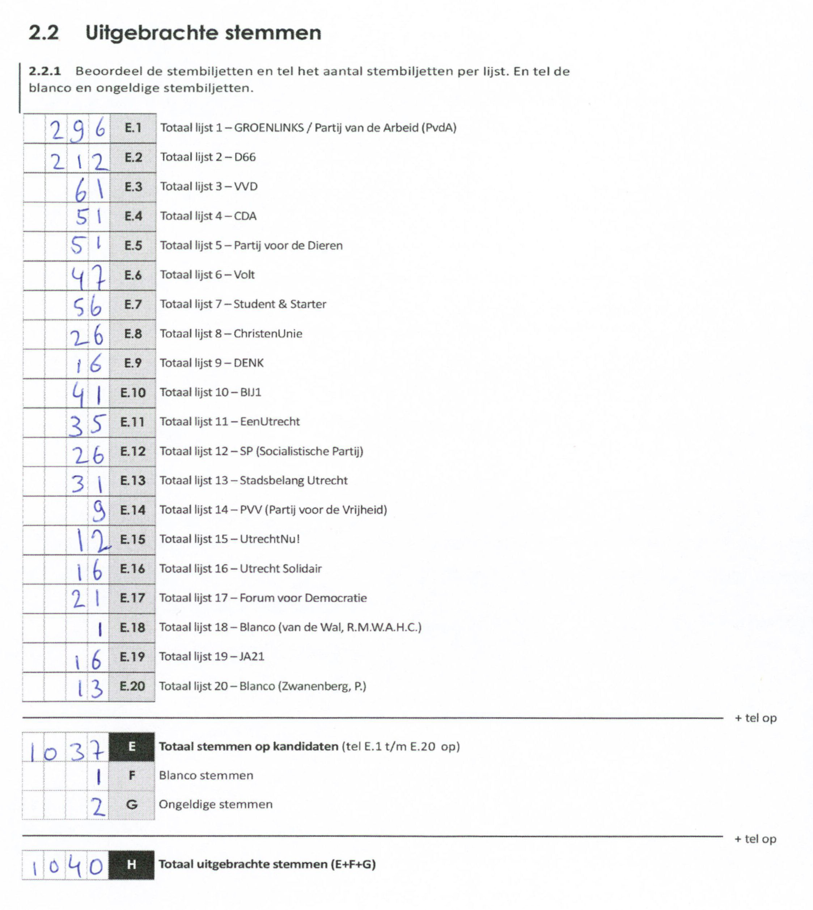
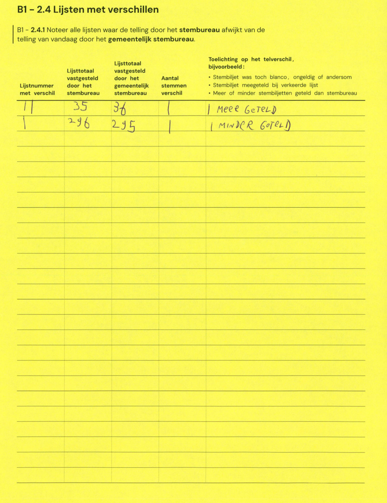

# Station 651 - Amsterdamsestraatweg 239A

- Status: `correction inconsistent`
- Markdown: `2026-GR/0344/results/Utrecht_651_Kledingbank_Utrecht_GR26_eerste_telling.md`
- Correction OCR: `2026-GR/0344/results/corrections/Utrecht_651_Kledingbank_Utrecht_GR26.md`

## Correction Inconsistency

The correction table does not line up with the first-count Markdown. Inspect the correction crop before treating this as a plain official-result mismatch.


## Details

- could not apply corrections: E.1 second=295, official=296

Legend: yellow/red = official CSV mismatch; blue = internal consistency issue. The right margin shows OCR and official values for official mismatches.



## Corrections

```markdown
| ID | First | Second | Difference | Note |
|---|---:|---:|---:|---|
| E.11 | 35 | 36 | 1 | MEER GETELD |
| E.1 | 296 | 295 | -1 | MINDER GETELD |
```


