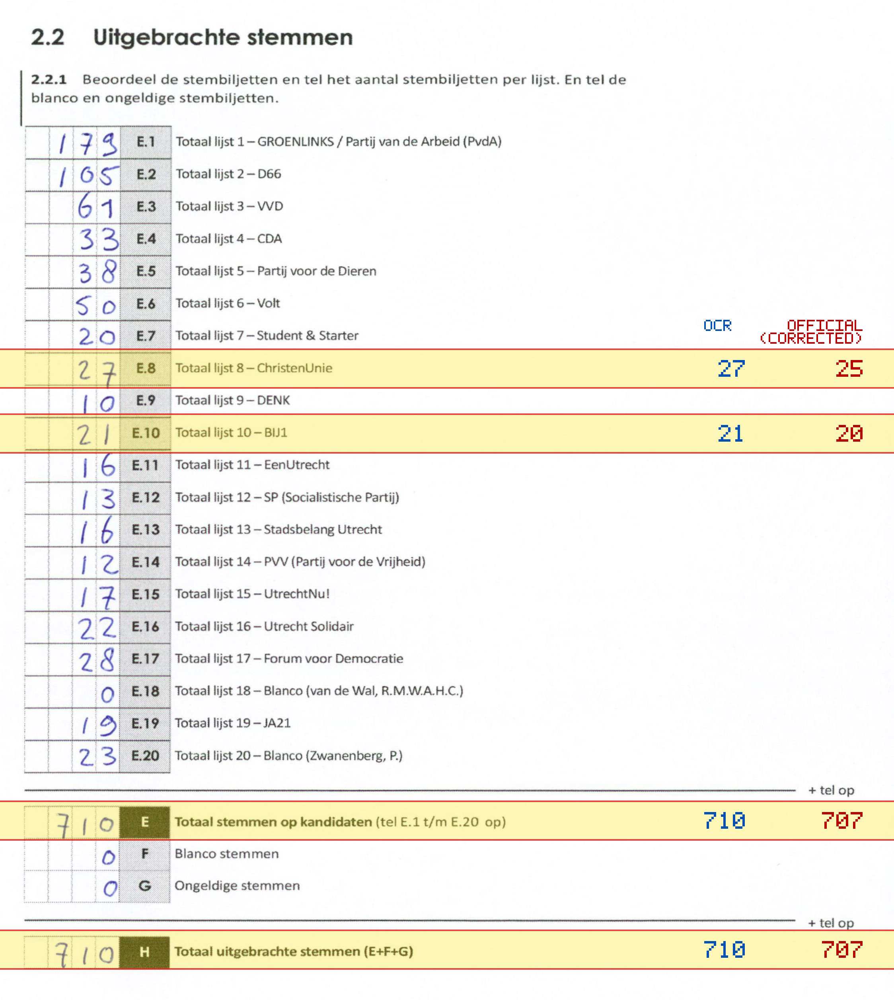
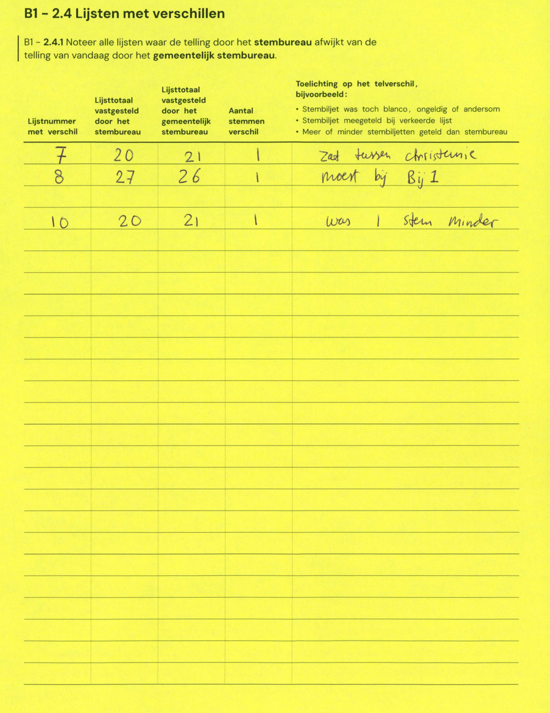

# Station 655 - Tjalkstraat 20

- Status: `correction inconsistent`
- Markdown: `2026-GR/0344/results/Utrecht_655_Buurthuis_De_Boeg_GR26_eerste_telling.md`
- Correction OCR: `2026-GR/0344/results/corrections/Utrecht_655_Buurthuis_De_Boeg_GR26.md`

## Correction Inconsistency

The correction table does not line up with the first-count Markdown. Inspect the correction crop before treating this as a plain official-result mismatch.


## Details

- could not apply corrections: E.10 second=21, official=20

Legend: yellow/red = official CSV mismatch; blue = internal consistency issue. The right margin shows OCR and official values for official mismatches.



## Corrections

```markdown
| ID | First | Second | Difference | Note |
|---|---:|---:|---:|---|
| E.7 | 20 | 21 | 1 | Zat tussen christenie |
| E.8 | 27 | 26 | 1 | moet bij 1 |
| E.10 | 20 | 21 | 1 | was 1 stem minder |
```


