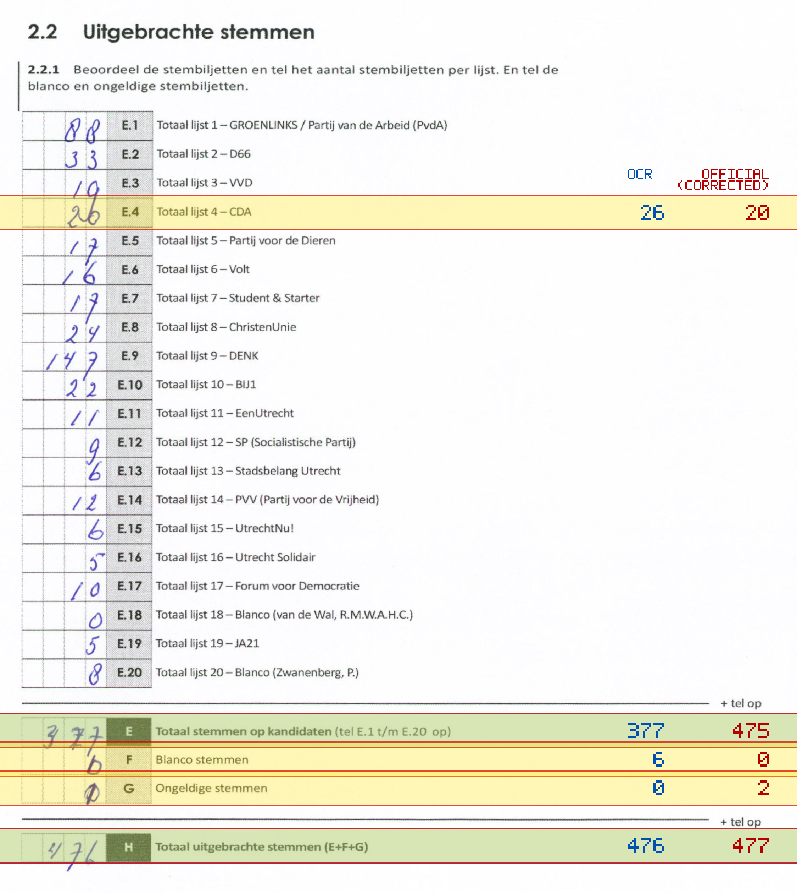
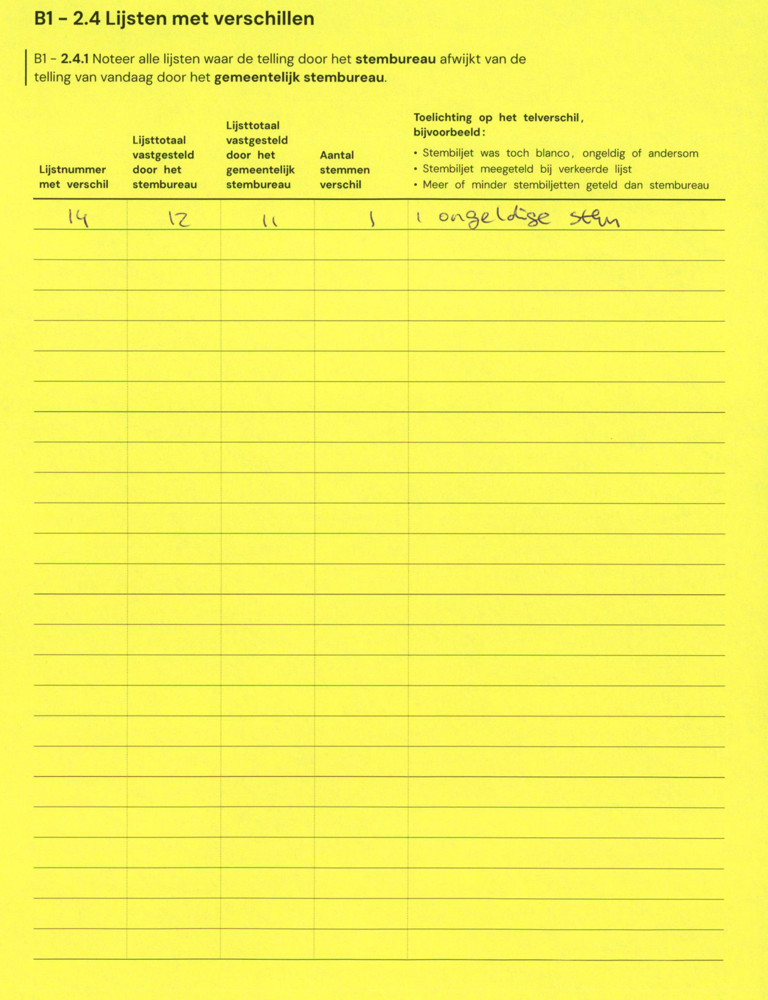

# Station 659 - Marco Pololaan 185

- Status: `internally inconsistent`
- Markdown: `2026-GR/0344/results/Utrecht_659_Triumfatorkerk_GR26_eerste_telling.md`
- Correction OCR: `2026-GR/0344/results/corrections/Utrecht_659_Triumfatorkerk_GR26.md`

## Details

- E.1 through E.20 sum to 481, but E is 377
- E + F + G is 383, but H is 476
- E.4: md=26, official=20
- E: md=377, official=475
- F: md=6, official=0
- G: md=0, official=2
- H: md=476, official=477

Legend: yellow/red = official CSV mismatch; blue = internal consistency issue. The right margin shows OCR and official values for official mismatches.



## Corrections

```markdown
| ID | First | Second | Difference | Note |
|---|---:|---:|---:|---|
| E.14 | 12 | 11 | -1 | ongeldige stem |
```


