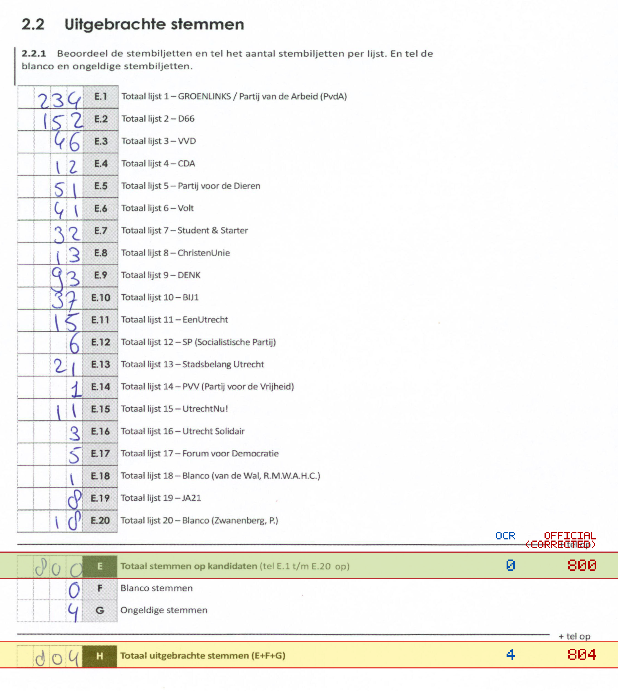
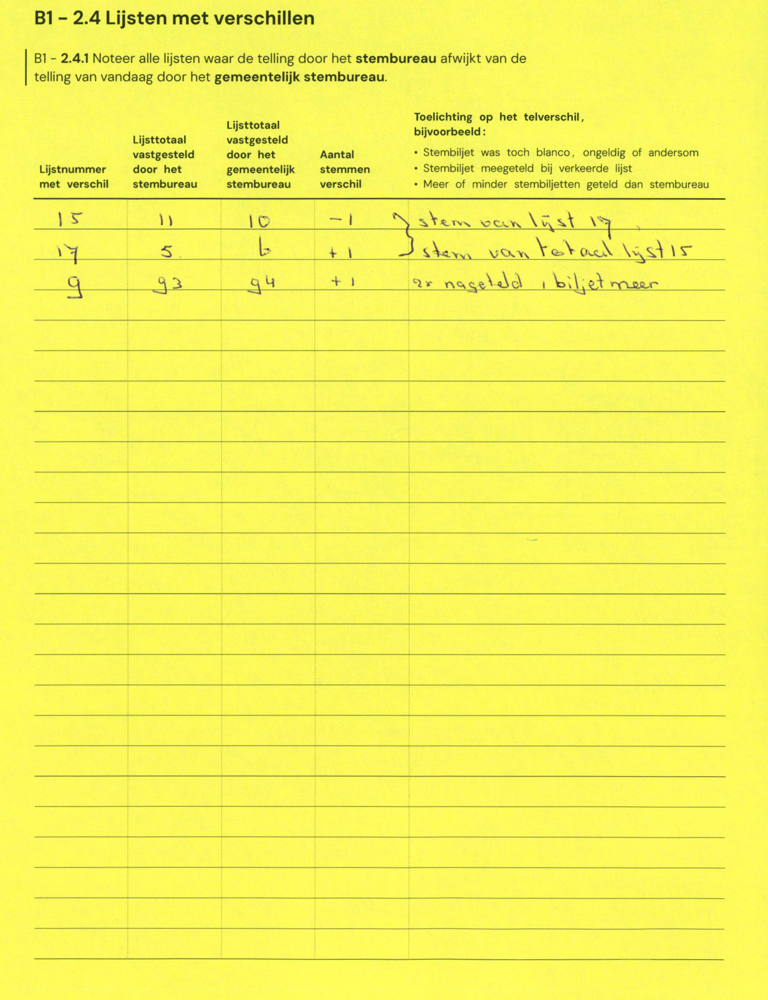

# Station 669 - Moskeeplein 89

- Status: `internally inconsistent`
- Markdown: `2026-GR/0344/results/Utrecht_669_Ulu_Moskee_GR26_eerste_telling.md`
- Correction OCR: `2026-GR/0344/results/corrections/Utrecht_669_Ulu_Moskee_GR26.md`

## Details

- E.1 through E.20 sum to 800, but E is 0
- E: md=0, official=800
- H: md=4, official=804

Legend: yellow/red = official CSV mismatch; blue = internal consistency issue. The right margin shows OCR and official values for official mismatches.



## Corrections

```markdown
| ID | First | Second | Difference | Note |
|---|---:|---:|---:|---|
| E.15 | 11 | 10 | -1 | stem van lijst 17 |
| E.17 | 5 | 6 | 1 | stem van totaal lijst 15 |
| E.9 | 93 | 94 | 1 | 9x nageteld 1 biljet meer |
```


