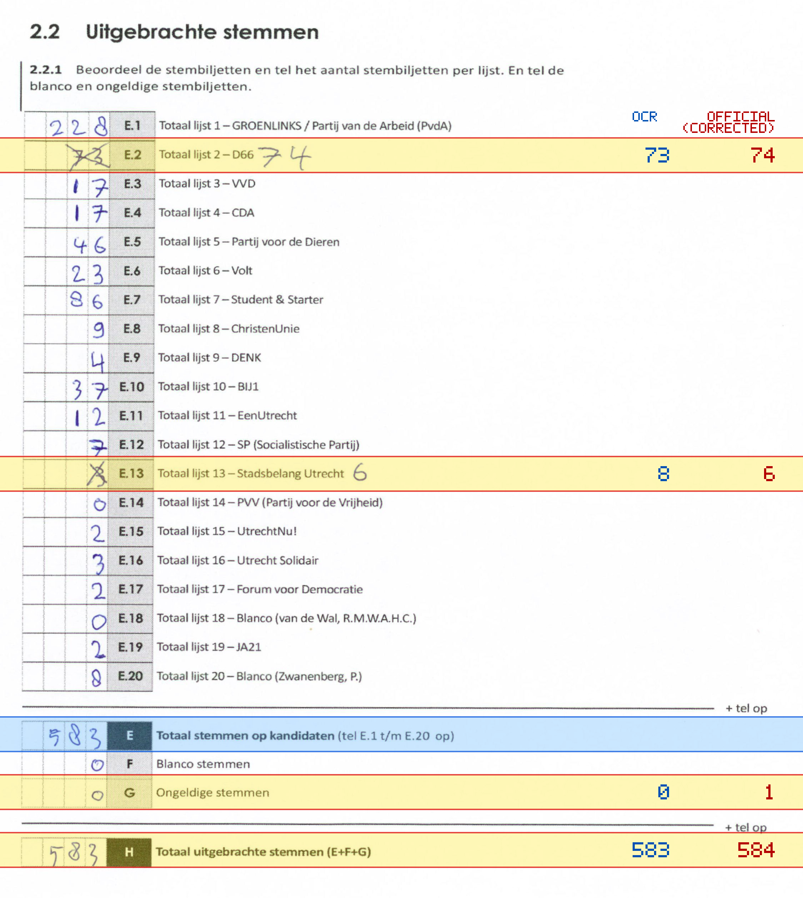
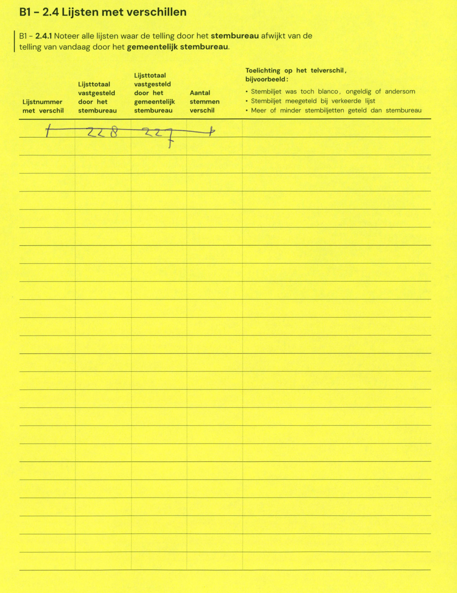

# Station 677 - Budapestlaan 4A-B

- Status: `internally inconsistent`
- Markdown: `2026-GR/0344/results/Utrecht_677_Victor_Koningsbergergebouw_GR26_eerste_telling.md`
- Correction OCR: `2026-GR/0344/results/corrections/Utrecht_677_Victor_Koningsbergergebouw_GR26.md`

## Details

- E.1 through E.20 sum to 584, but E is 583
- E.2: md=73, official=74
- E.13: md=8, official=6
- G: md=0, official=1
- H: md=583, official=584

## Candidate Votes

- Status: `incomplete`
- Compared candidate cells: 0/508
- Candidate OCR files: 0
- candidate OCR not available
- known list/correction issues are shown

Legend: yellow/red = official CSV mismatch; blue = internal consistency issue. The right margin shows OCR and official values for official mismatches.



## Corrections

```markdown
| ID | First | Second | Difference | Note |
|---|---:|---:|---:|---|
| E.1 | 228 | 227 | -1 |  |
```


