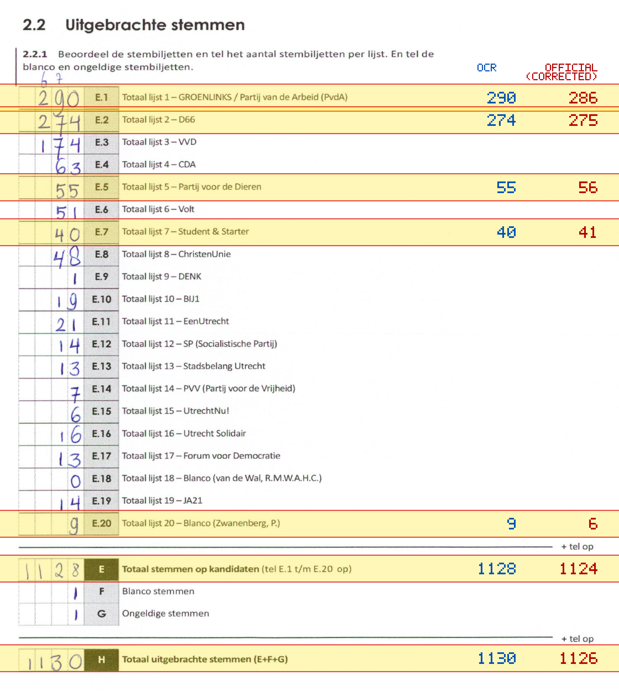
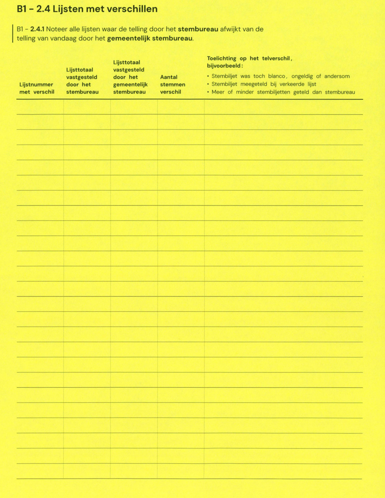

# Station 679 - Prinsesselaan 2

- Status: `mismatch`
- Markdown: `2026-GR/0344/results/Utrecht_679_St_Barbara_GR26_eerste_telling.md`
- Correction OCR: `2026-GR/0344/results/corrections/Utrecht_679_St_Barbara_GR26.md`

## Details

- E.1: md=290, official=286
- E.2: md=274, official=275
- E.5: md=55, official=56
- E.7: md=40, official=41
- E.20: md=9, official=6
- E: md=1128, official=1124
- H: md=1130, official=1126

Legend: yellow/red = official CSV mismatch; blue = internal consistency issue. The right margin shows OCR and official values for official mismatches.



## Corrections

```markdown
| ID | First | Second | Difference | Note |
|---|---:|---:|---:|---|
```


