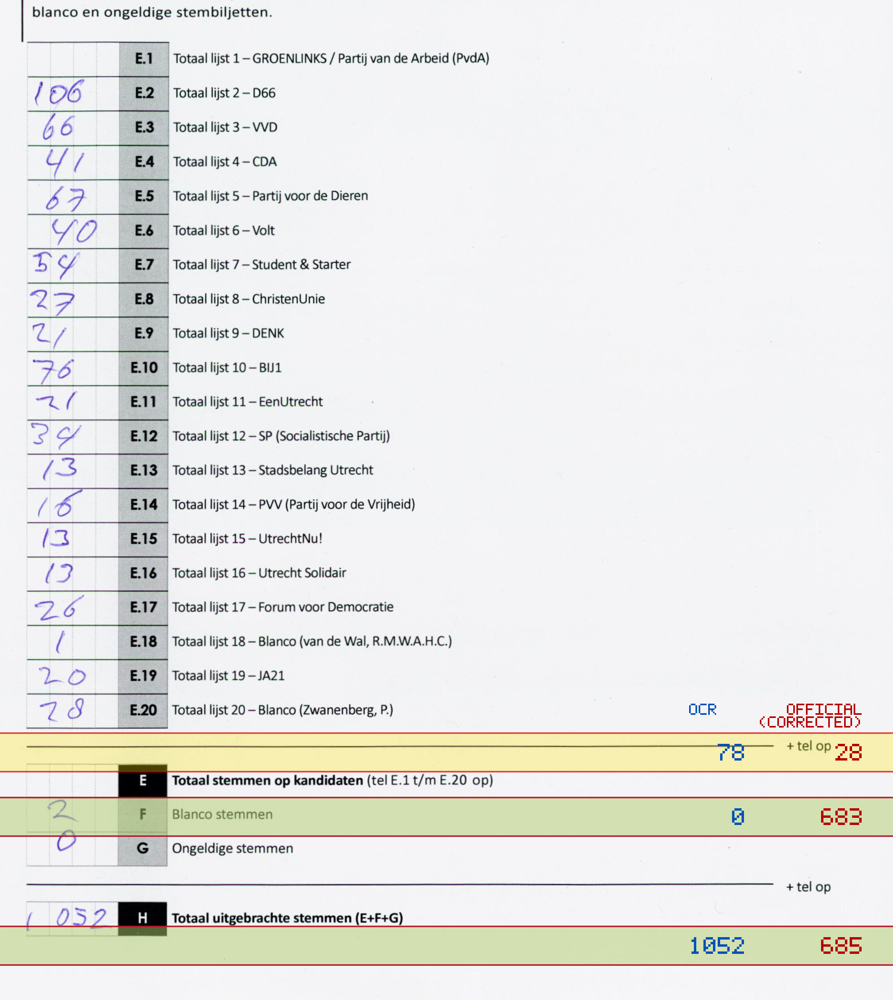
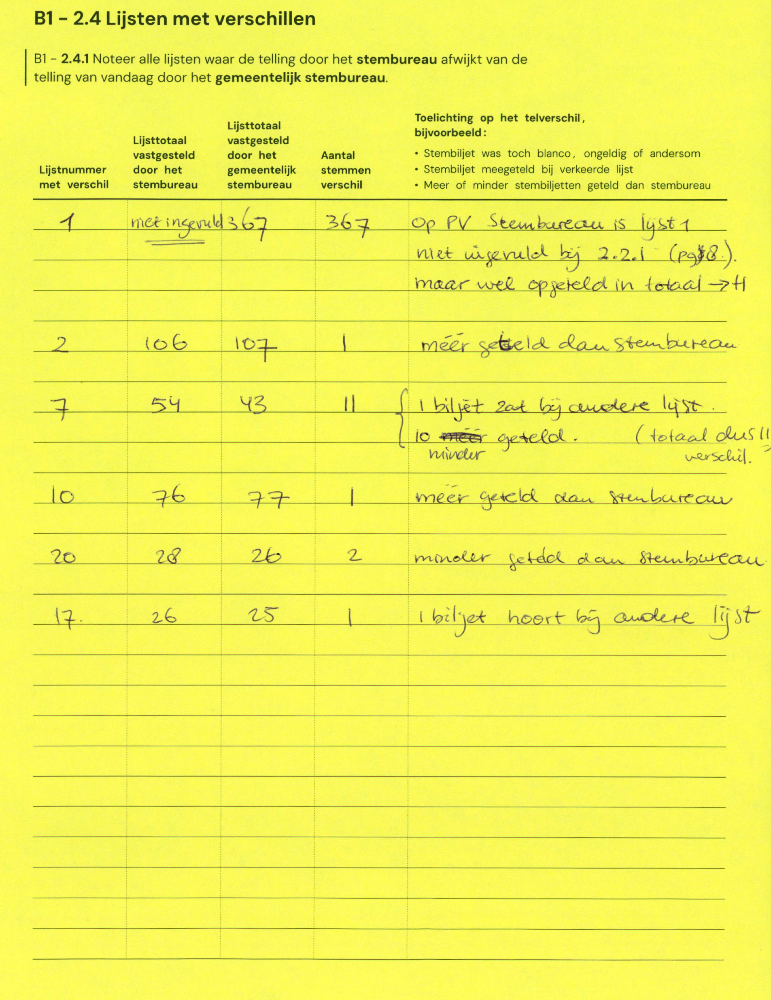

# Station 688 - Hondsrug 19

- Status: `internally inconsistent`
- Markdown: `2026-GR/0344/results/Utrecht_688_Buurtcentrum_De_Musketon_GR26_eerste_telling.md`
- Correction OCR: `2026-GR/0344/results/corrections/Utrecht_688_Buurtcentrum_De_Musketon_GR26.md`

## Details

- E.1 through E.20 sum to 733, but E is 0
- E + F + G is 2, but H is 1052
- E.20: md=78, official=28
- E: md=0, official=683
- H: md=1052, official=685

Legend: yellow/red = official CSV mismatch; blue = internal consistency issue. The right margin shows OCR and official values for official mismatches.



## Corrections

```markdown
| ID | First | Second | Difference | Note |
|---|---:|---:|---:|---|
| E.1 |  | 367 | 367 | op PV stembureau is lijst 1 niet ingevuld bij 2.2.1 (pg 8), maar wel opgeteld in totaal -> H |
| E.2 | 106 | 107 | 1 | meer geteld dan stembureau |
| E.7 | 54 | 43 | -11 | 1 biljet zat bij andere lijst, 10 meer geteld. (totaal dus 11 minder verschil) |
| E.10 | 76 | 77 | 1 | meer geteld dan stembureau |
| E.20 | 28 | 26 | -2 | minder geteld dan stembureau |
| E.17 | 26 | 25 | -1 | 1 biljet hoort bij andere lijst |
```


