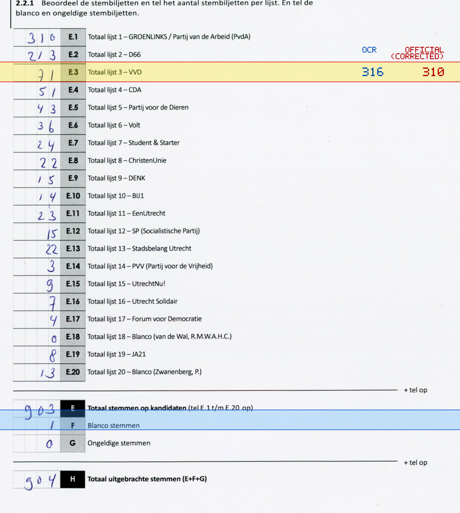
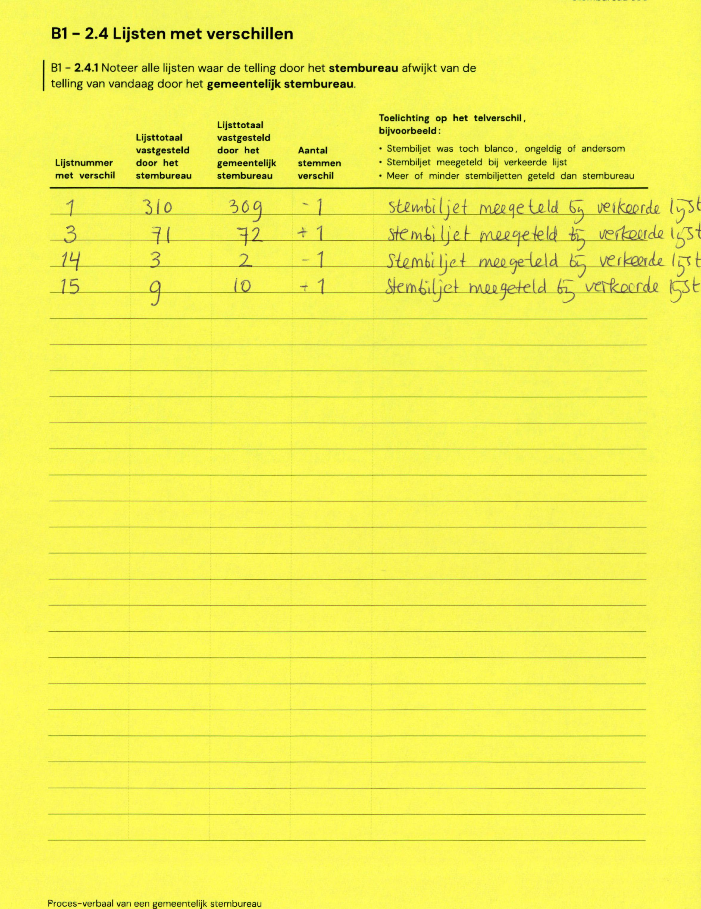

# Station 690 - Heycopplein 5

- Status: `internally inconsistent`
- Markdown: `2026-GR/0344/results/Utrecht_690_De_Halter_GR26_eerste_telling.md`
- Correction OCR: `2026-GR/0344/results/corrections/Utrecht_690_De_Halter_GR26.md`

## Details

- E.1 through E.20 sum to 909, but E is 903
- E.1: md=316, official=310

Legend: yellow/red = official CSV mismatch; blue = internal consistency issue. The right margin shows OCR and official values for official mismatches.



## Corrections

```markdown
| ID | First | Second | Difference | Note |
|---|---:|---:|---:|---|
| E.1 | 310 | 309 | -1 | stembiljet meegeteld bij verkeerde lijst |
| E.3 | 71 | 72 | 1 | stembiljet meegeteld bij verkeerde lijst |
| E.14 | 3 | 2 | -1 | stembiljet meegeteld bij verkeerde lijst |
| E.15 | 9 | 10 | 1 | stembiljet meegeteld bij verkeerde lijst |
```


