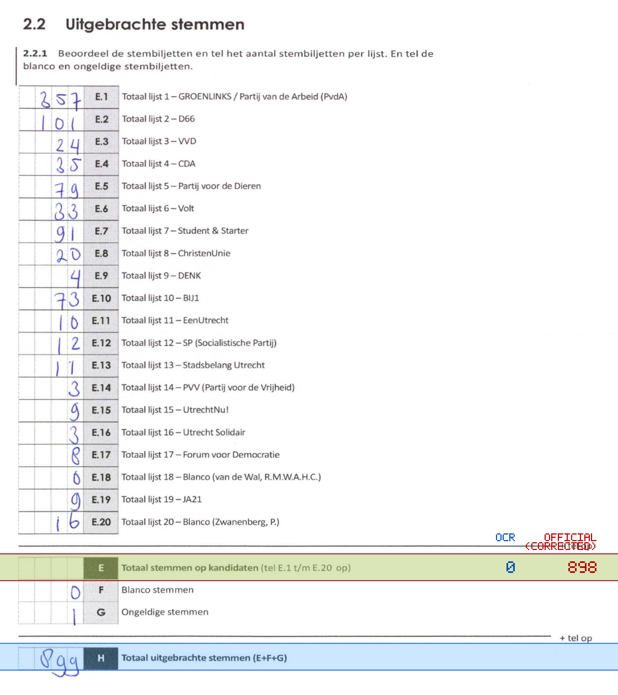
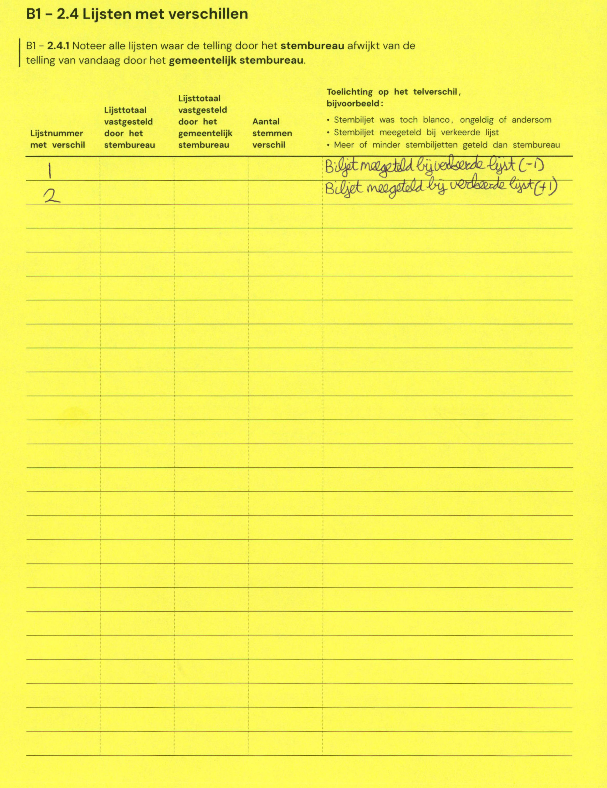

# Station 693 - Heidelberglaan 3

- Status: `internally inconsistent`
- Markdown: `2026-GR/0344/results/Utrecht_693_Universiteitsbibliotheek_Uithof_GR26_eerste_telling.md`
- Correction OCR: `2026-GR/0344/results/corrections/Utrecht_693_Universiteitsbibliotheek_Uithof_GR26.md`

## Details

- E.1 through E.20 sum to 898, but E is 0
- E + F + G is 1, but H is 899
- E: md=0, official=898

## Candidate Votes

- Status: `incomplete`
- Compared candidate cells: 0/508
- Candidate OCR files: 0
- candidate OCR not available
- known list/correction issues are shown

Legend: yellow/red = official CSV mismatch; blue = internal consistency issue. The right margin shows OCR and official values for official mismatches.



## Corrections

```markdown
| ID | First | Second | Difference | Note |
|---|---:|---:|---:|---|
| E.1 |  |  | -1 | Biljet meegeteld bij verkeerde lijst (-1) |
| E.2 |  |  | 1 | Biljet meegeteld bij verkeerde lijst (+1) |
```


