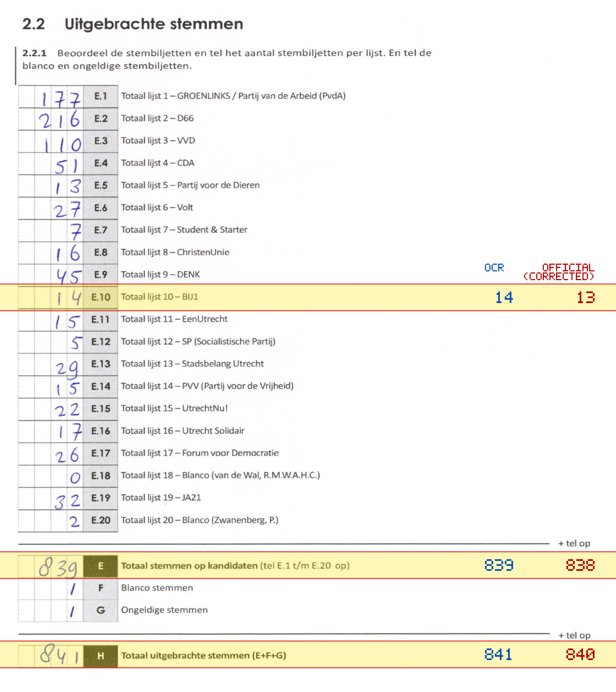
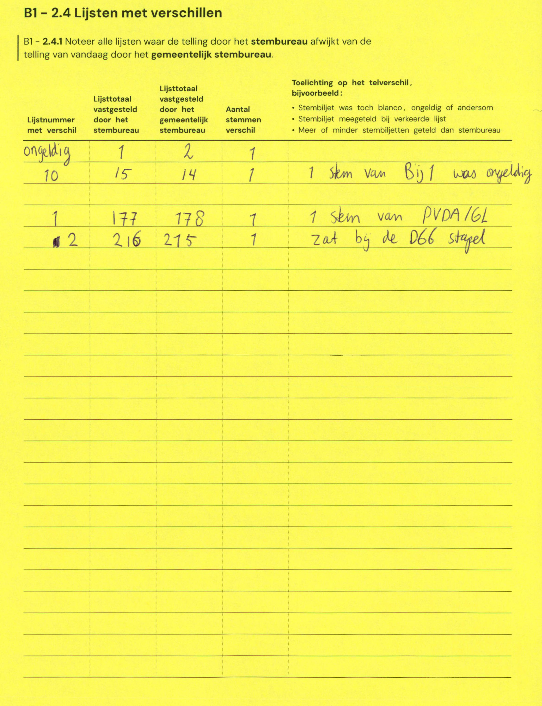

# Station 711 - Pauwoogvlinder 20

- Status: `correction inconsistent`
- Markdown: `2026-GR/0344/results/Utrecht_711_Buurtcentrum__t_Zand_GR26_eerste_telling.md`
- Correction OCR: `2026-GR/0344/results/corrections/Utrecht_711_Buurtcentrum__t_Zand_GR26.md`

## Correction Inconsistency

The correction table does not line up with the first-count Markdown. Inspect the correction crop before treating this as a plain official-result mismatch.


## Details

- could not apply corrections: E.10 second=14, official=13

Legend: yellow/red = official CSV mismatch; blue = internal consistency issue. The right margin shows OCR and official values for official mismatches.



## Corrections

```markdown
| ID | First | Second | Difference | Note |
|---|---:|---:|---:|---|
| G | 1 | 2 | 1 | 1 stem van Bij 1 was ongeldig |
| E.10 | 15 | 14 | -1 | |
| E.1 | 177 | 178 | 1 | 1 stem van PVDA/GL |
| E.2 | 216 | 215 | -1 | zat bij de D66 stapel |
```


