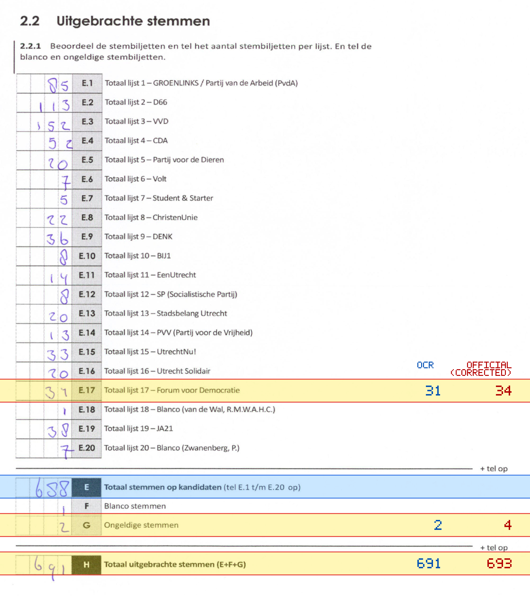
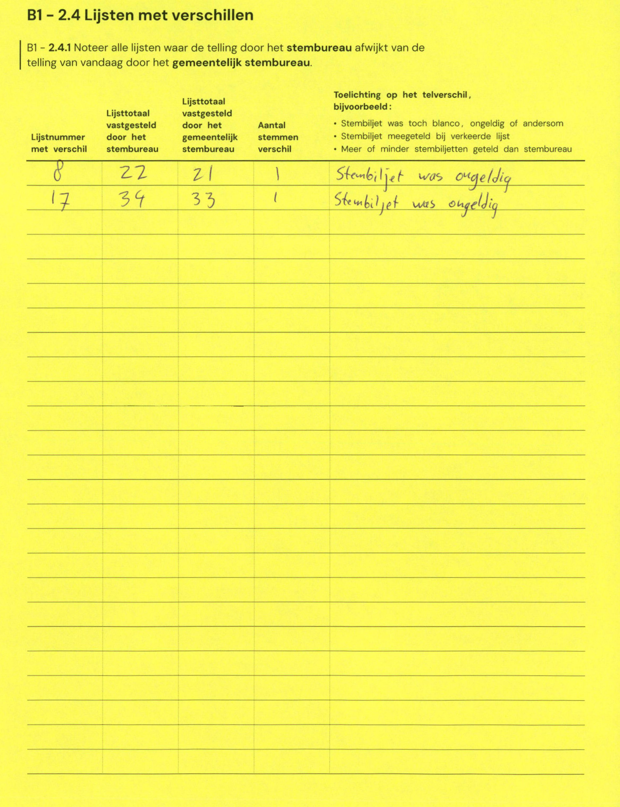

# Station 715 - Oesterzwam nabij station Vleuten

- Status: `internally inconsistent`
- Markdown: `2026-GR/0344/results/Utrecht_715_Tijdelijke_unit_PenR_Vleuten_GR26_eerste_telling.md`
- Correction OCR: `2026-GR/0344/results/corrections/Utrecht_715_Tijdelijke_unit_PenR_Vleuten_GR26.md`

## Details

- E.1 through E.20 sum to 685, but E is 688
- E.17: md=31, official=34
- G: md=2, official=4
- H: md=691, official=693

## Candidate Votes

- Status: `incomplete`
- Compared candidate cells: 0/508
- Candidate OCR files: 0
- candidate OCR not available
- known list/correction issues are shown

Legend: yellow/red = official CSV mismatch; blue = internal consistency issue. The right margin shows OCR and official values for official mismatches.



## Corrections

```markdown
| ID | First | Second | Difference | Note |
|---|---:|---:|---:|---|
| E.8 | 22 | 21 | -1 | Stembiljet was ongeldig |
| E.17 | 34 | 33 | -1 | Stembiljet was ongeldig |
```


