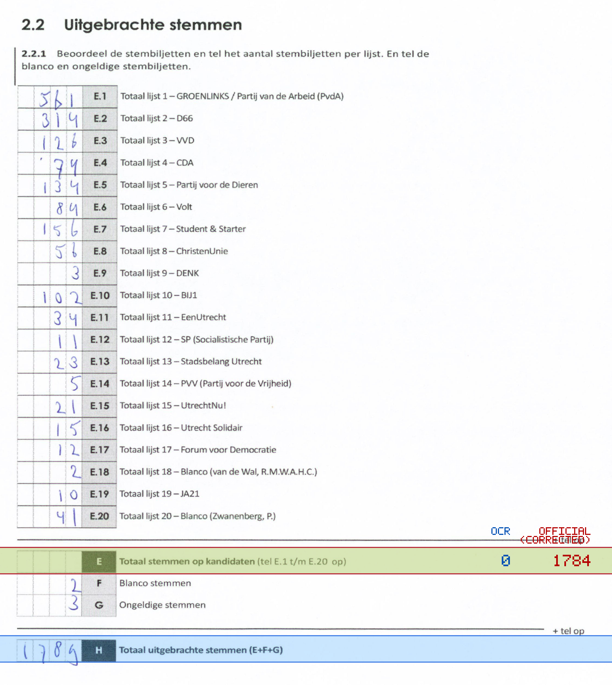
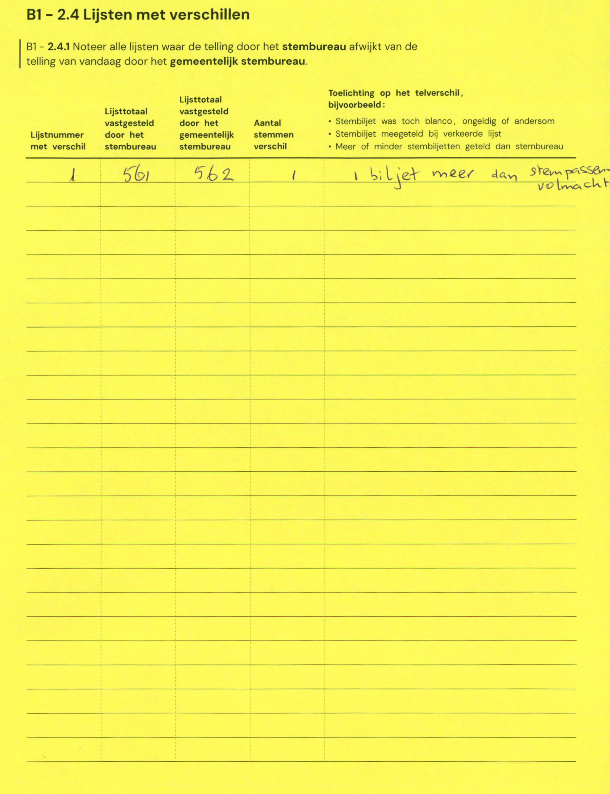

# Station 718 - Domplein 21

- Status: `internally inconsistent`
- Markdown: `2026-GR/0344/results/Utrecht_718_Domtoren_GR26_eerste_telling.md`
- Correction OCR: `2026-GR/0344/results/corrections/Utrecht_718_Domtoren_GR26.md`

## Details

- E.1 through E.20 sum to 1784, but E is 0
- E + F + G is 5, but H is 1789
- E: md=0, official=1784

## Candidate Votes

- Status: `incomplete`
- Compared candidate cells: 0/508
- Candidate OCR files: 0
- candidate OCR not available
- known list/correction issues are shown

Legend: yellow/red = official CSV mismatch; blue = internal consistency issue. The right margin shows OCR and official values for official mismatches.



## Corrections

```markdown
| ID | First | Second | Difference | Note |
|---|---:|---:|---:|---|
| E.1 | 561 | 562 | 1 | 1 biljet meer dan stempassen volmacht |
```


