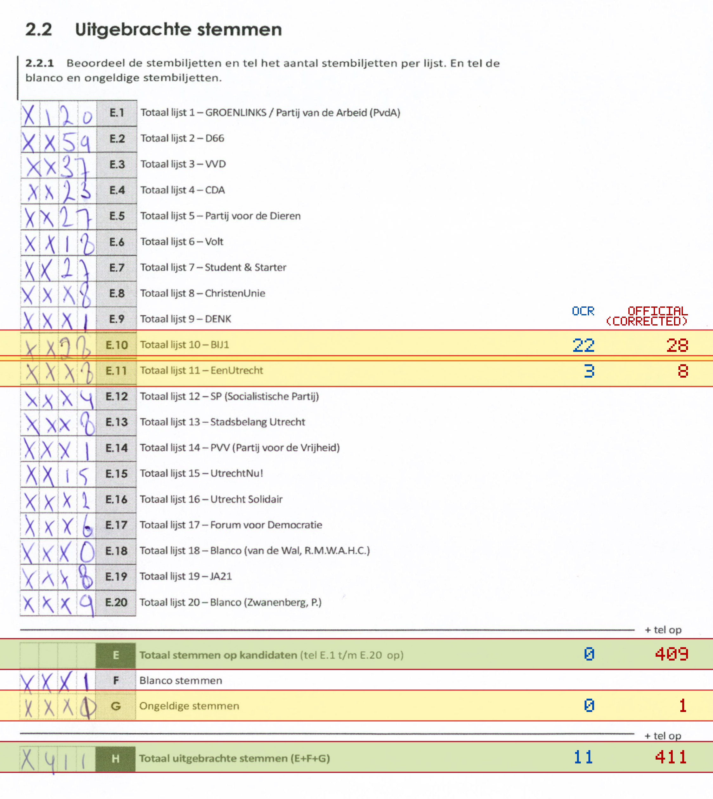
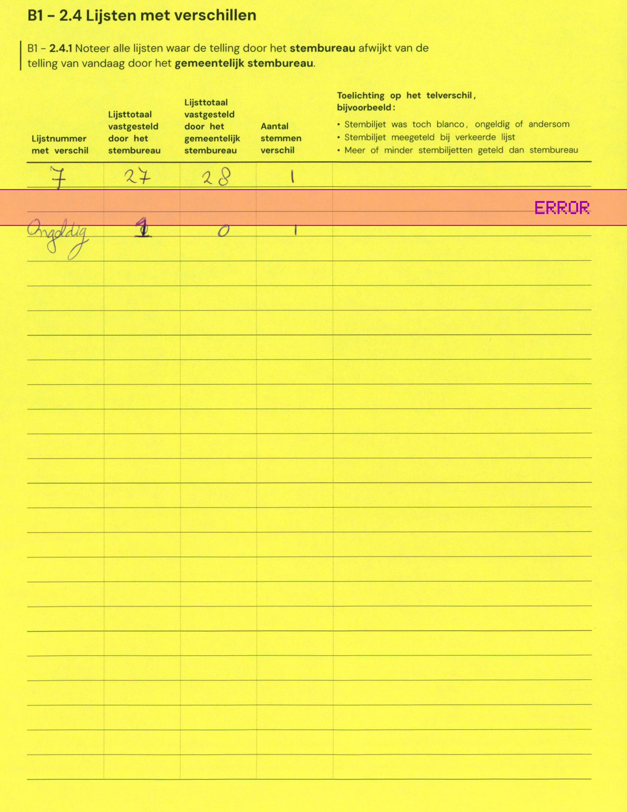

# Station 723 - Mariastraat 12

- Status: `internally inconsistent`
- Markdown: `2026-GR/0344/results/Utrecht_723_De_Makers_GR26_eerste_telling.md`
- Correction OCR: `2026-GR/0344/results/corrections/Utrecht_723_De_Makers_GR26.md`

## Details

- E.1 through E.20 sum to 398, but E is 0
- E + F + G is 1, but H is 11
- correction G first=1, Markdown=0, second=0
- E.10: md=22, official=28
- E.11: md=3, official=8
- E: md=0, official=409
- G: md=0, official=1
- H: md=11, official=411

## Candidate Votes

- Status: `incomplete`
- Compared candidate cells: 0/508
- Candidate OCR files: 0
- candidate OCR not available
- known list/correction issues are shown

Legend: yellow/red = official CSV mismatch; blue = internal consistency issue. The right margin shows OCR and official values for official mismatches.



## Corrections

```markdown
| ID | First | Second | Difference | Note |
|---|---:|---:|---:|---|
| E.7 | 27 | 28 | 1 |  |
| G | 1 | 0 | -1 |  |
```


