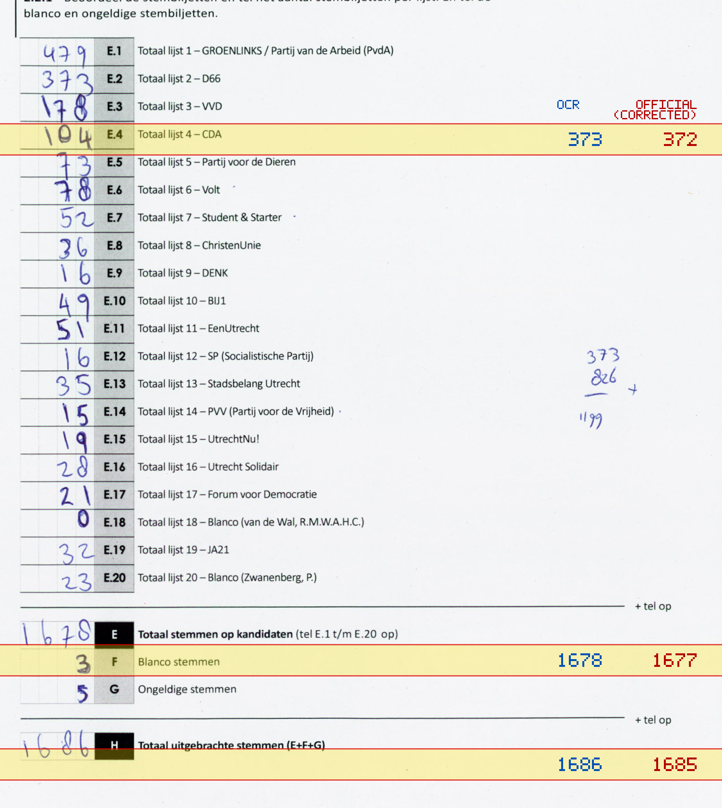
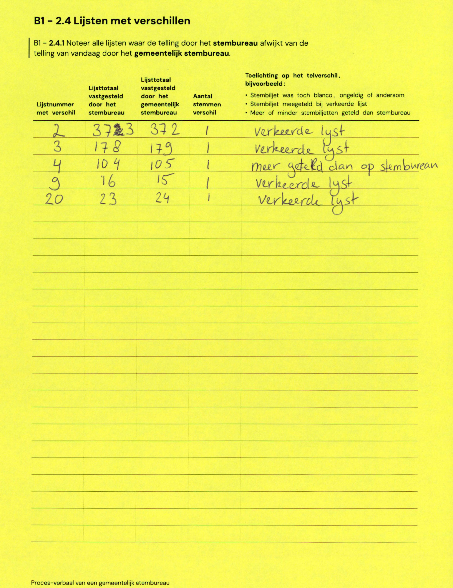

# Station 724 - Heycopstraat (op de stoep)

- Status: `correction inconsistent`
- Markdown: `2026-GR/0344/results/Utrecht_724_Portakabin_GR26_eerste_telling.md`
- Correction OCR: `2026-GR/0344/results/corrections/Utrecht_724_Portokabin_GR26.md`

## Correction Inconsistency

The correction table does not line up with the first-count Markdown. Inspect the correction crop before treating this as a plain official-result mismatch.


## Details

- could not apply corrections: E.2 second=373, official=372

## Candidate Votes

- Status: `incomplete`
- Compared candidate cells: 0/508
- Candidate OCR files: 0
- candidate OCR not available
- known list/correction issues are shown

Legend: yellow/red = official CSV mismatch; blue = internal consistency issue. The right margin shows OCR and official values for official mismatches.



## Corrections

```markdown
| ID | First | Second | Difference | Note |
|---|---:|---:|---:|---|
| E.2 | 372 | 373 | 1 | verkeerde lijst |
| E.3 | 178 | 179 | 1 | verkeerde lijst |
| E.4 | 104 | 105 | 1 | meer geteld dan op stembureau |
| E.9 | 16 | 15 | -1 | verkeerde lijst |
| E.20 | 23 | 24 | 1 | verkeerde lijst |
```


