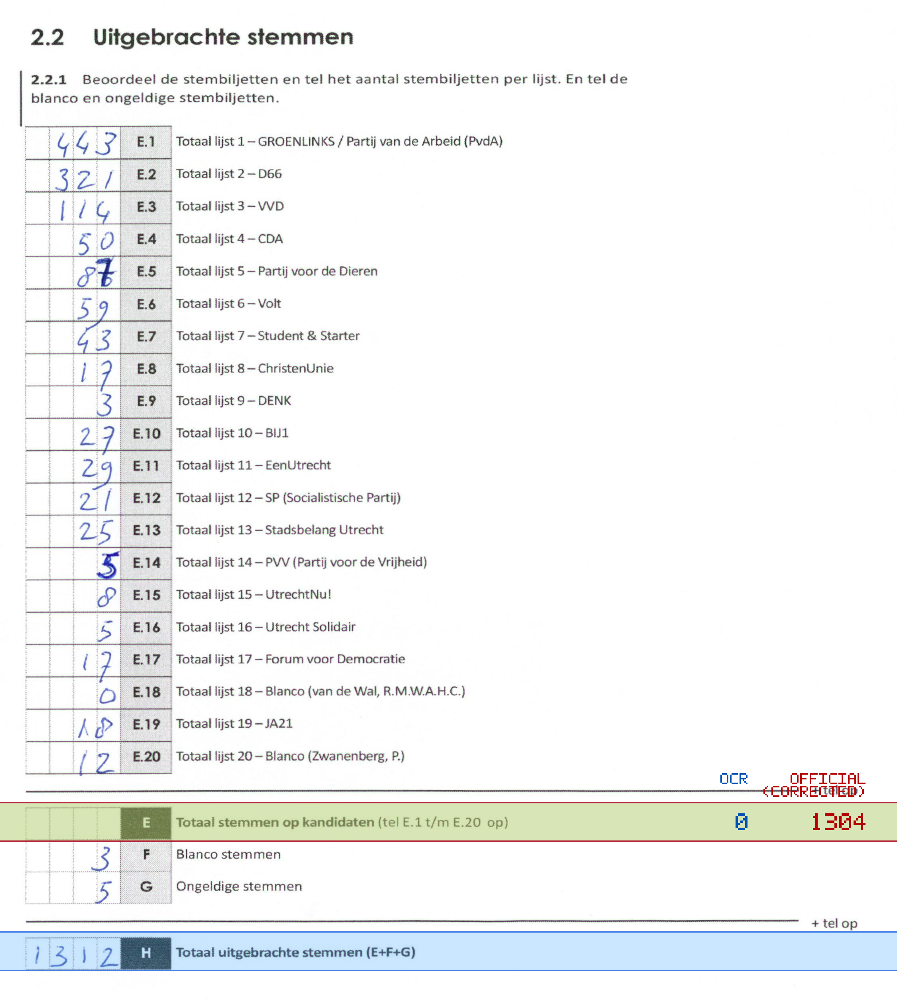
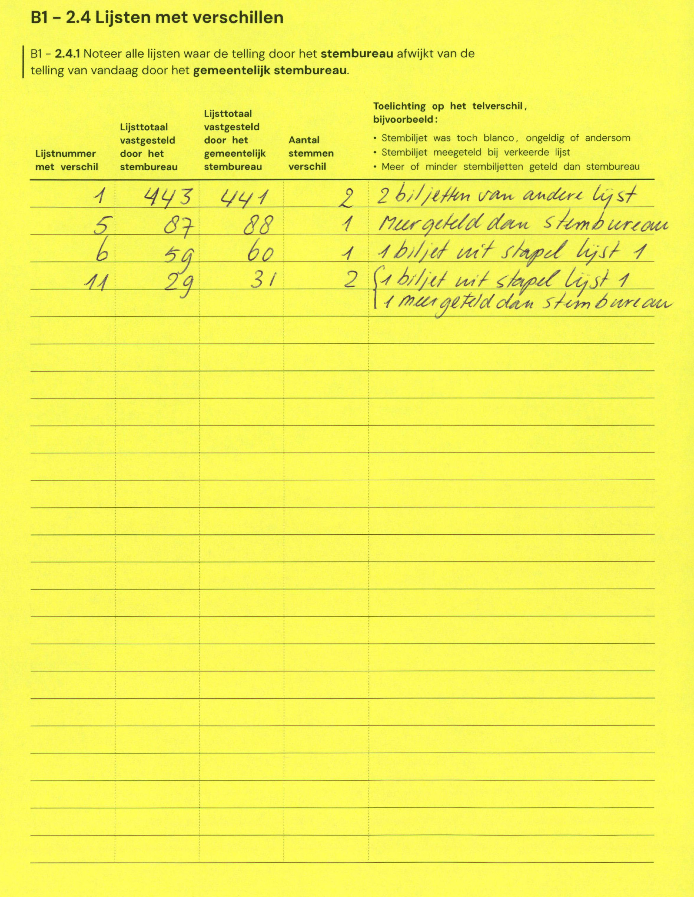

# Station 74 - Bouwstraat 55

- Status: `internally inconsistent`
- Markdown: `2026-GR/0344/results/Utrecht_74_ZIMIHC_theater_Wittevrouwen_GR26_eerste_telling.md`
- Correction OCR: `2026-GR/0344/results/corrections/Utrecht_74_ZIMIHC_theater_Wittevrouwen_GR26.md`

## Details

- E.1 through E.20 sum to 1304, but E is 0
- E + F + G is 8, but H is 1312
- E: md=0, official=1304

Legend: yellow/red = official CSV mismatch; blue = internal consistency issue. The right margin shows OCR and official values for official mismatches.



## Corrections

```markdown
| ID | First | Second | Difference | Note |
|---|---:|---:|---:|---|
| E.1 | 443 | 441 | -2 | 2 biljetten van andere lijst |
| E.5 | 87 | 88 | 1 | Meer geteld dan stembureau |
| E.6 | 59 | 60 | 1 | 1 biljet uit stapel lijst 1 |
| E.11 | 29 | 31 | 2 | 1 biljet uit stapel lijst 1 1 meer geteld dan stembureau |
```


