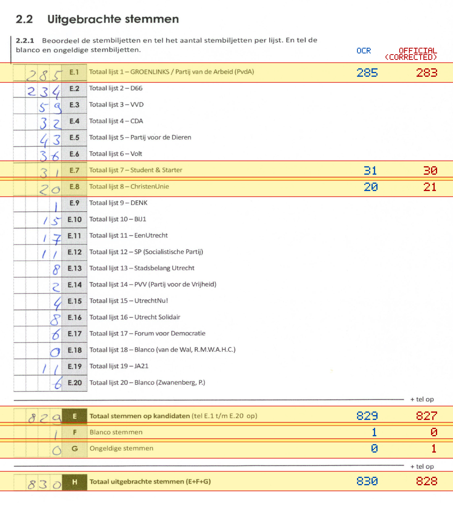
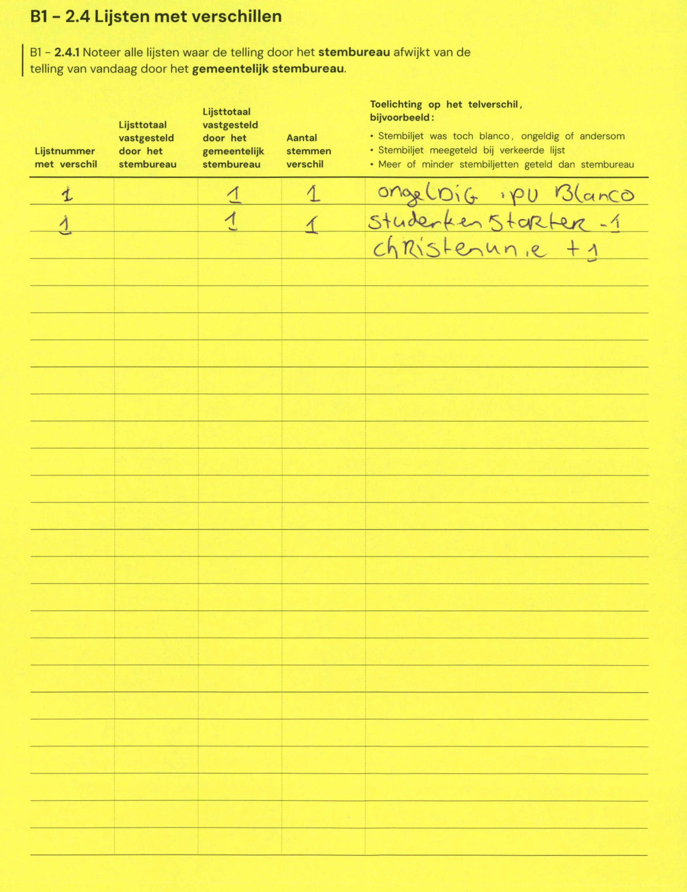

# Station 76 - Poortstraat 73 ingang via Bladstraat

- Status: `mismatch`
- Markdown: `2026-GR/0344/results/Utrecht_76_Jenaplanschool_Wittevrouwen_Poortstraat_GR26_eerste_telling.md`
- Correction OCR: `2026-GR/0344/results/corrections/Utrecht_76_Jenaplanschool_Wittevrouwen_Poortstraat_GR26.md`

## Details

- E.1: md=285, official=283
- E.7: md=31, official=30
- E.8: md=20, official=21
- E: md=829, official=827
- F: md=1, official=0
- G: md=0, official=1
- H: md=830, official=828

Legend: yellow/red = official CSV mismatch; blue = internal consistency issue. The right margin shows OCR and official values for official mismatches.



## Corrections

```markdown
| ID | First | Second | Difference | Note |
|---|---:|---:|---:|---|
| E.1 |  | 1 | 1 | ongeldig ipv blanco |
| E.1 |  | 1 | 1 | studerken starter -1 christenunie +1 |
```


