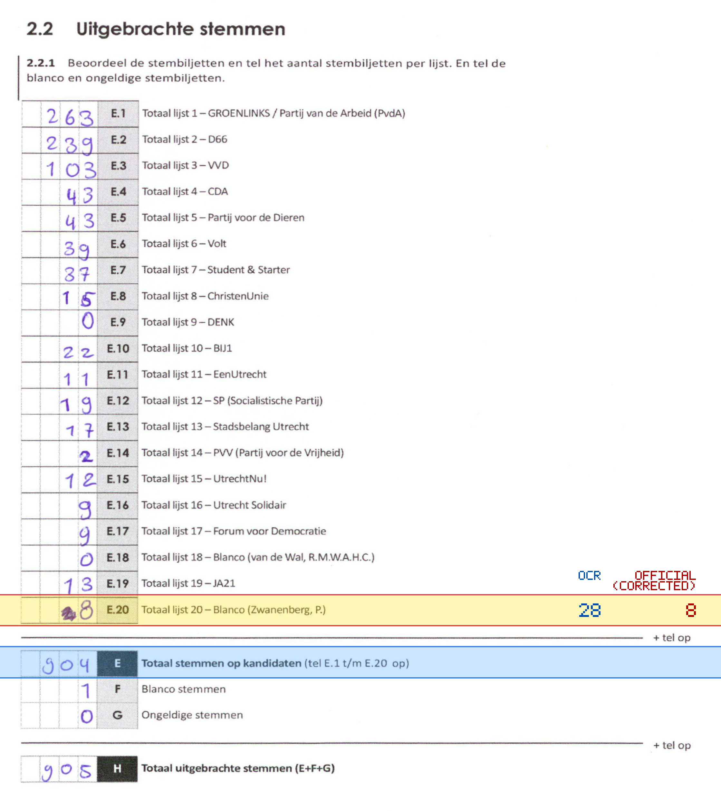
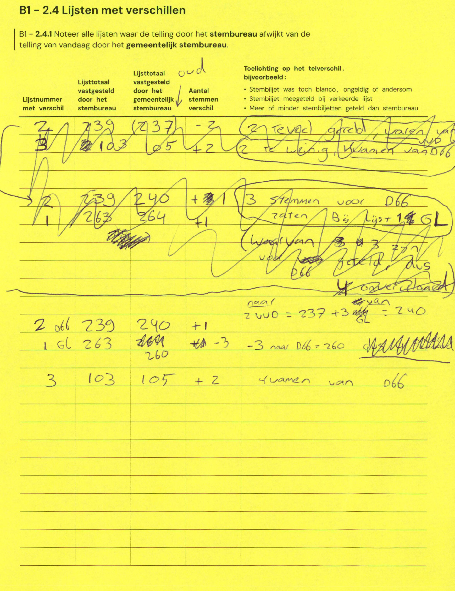

# Station 77 - Oude Kerkstraat 2A ingang via kleuterplein

- Status: `internally inconsistent`
- Markdown: `2026-GR/0344/results/Utrecht_77_Jenaplanschool_Wittevrouwen_Oude_Kerkstraat_GR26_eerste_telling.md`
- Correction OCR: `2026-GR/0344/results/corrections/Utrecht_77_Jenaplanschool_Wittevrouwen_Oude_Kerkstraat_GR26.md`

## Details

- E.1 through E.20 sum to 924, but E is 904
- E.20: md=28, official=8

Legend: yellow/red = official CSV mismatch; blue = internal consistency issue. The right margin shows OCR and official values for official mismatches.



## Corrections

```markdown
| ID | First | Second | Difference | Note |
|---|---:|---:|---:|---|
| E.2 | 239 | 240 | 1 | 2 VVD = 237 + 3 GL = 240 |
| E.1 | 263 | 260 | -3 | -3 naar D66 = 260 |
| E.3 | 103 | 105 | 2 | kwamen van D66 |
```


