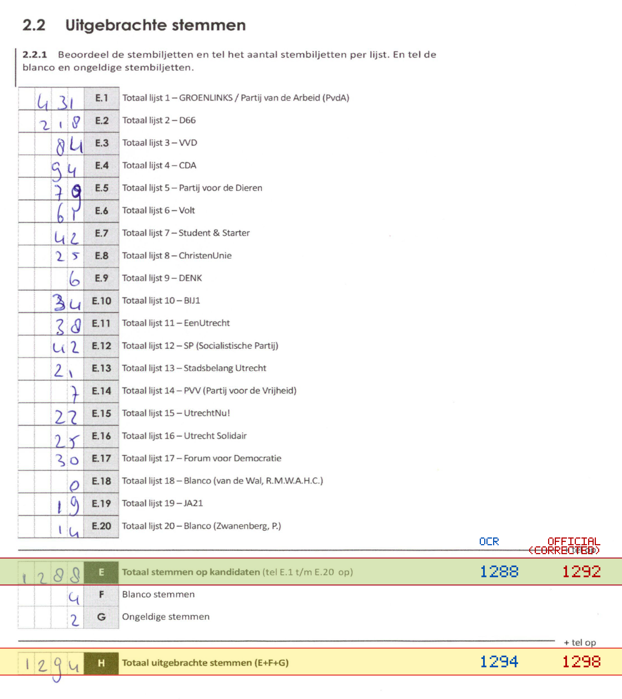
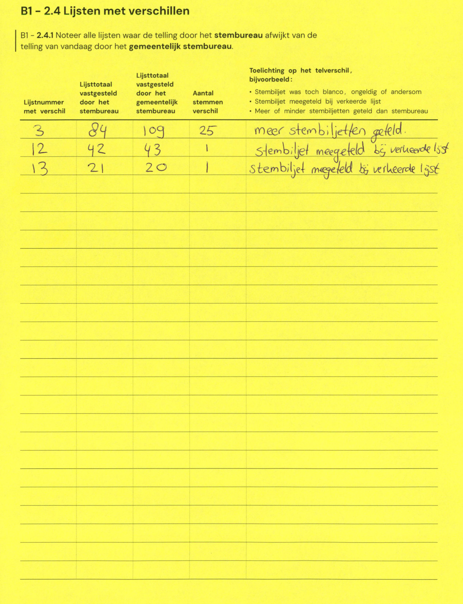

# Station 8 - Lange Smeestraat 40

- Status: `internally inconsistent`
- Markdown: `2026-GR/0344/results/Utrecht_8_Bartholomeus_Gasthuis_GR26_eerste_telling.md`
- Correction OCR: `2026-GR/0344/results/corrections/Utrecht_8_Bartholomeus_Gasthuis_GR26.md`

## Details

- E.1 through E.20 sum to 1292, but E is 1288
- E: md=1288, official=1292
- H: md=1294, official=1298

## Candidate Votes

- Status: `incomplete`
- Compared candidate cells: 0/508
- Candidate OCR files: 0
- candidate OCR not available
- known list/correction issues are shown

Legend: yellow/red = official CSV mismatch; blue = internal consistency issue. The right margin shows OCR and official values for official mismatches.



## Corrections

```markdown
| ID | First | Second | Difference | Note |
|---|---:|---:|---:|---|
| E.3 | 84 | 109 | 25 | meer stembiljetten geteld |
| E.12 | 42 | 43 | 1 | stembiljet meegeteld bij verkeerde lijst |
| E.13 | 21 | 20 | -1 | stembiljet meegeteld bij verkeerde lijst |
```


