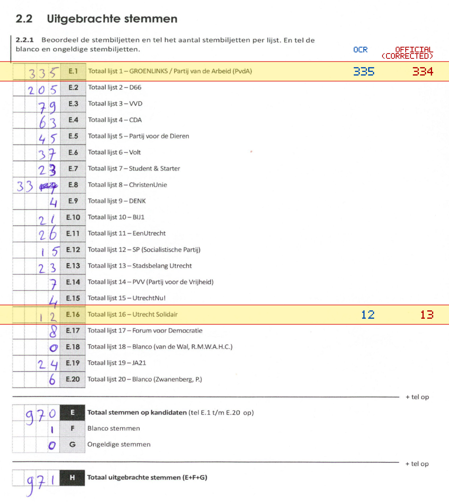
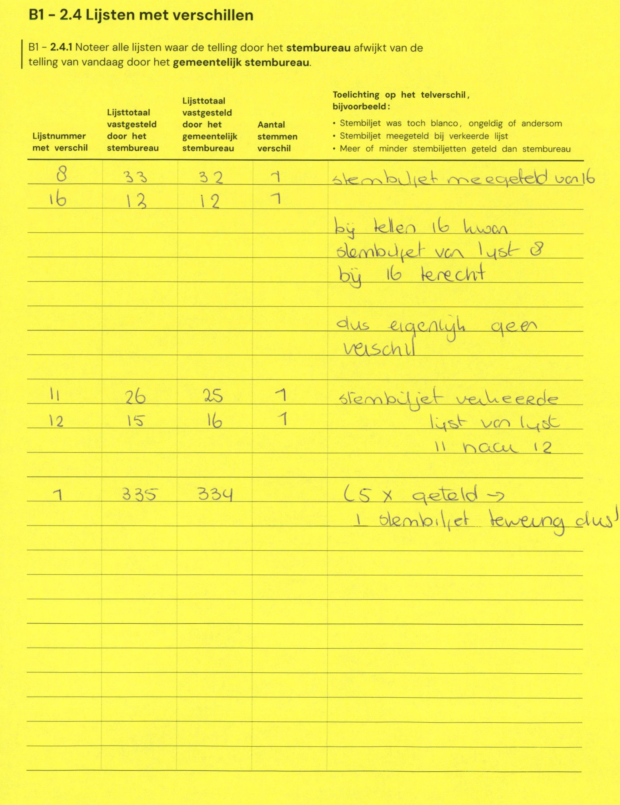

# Station 81 - Kouwerplantsoen 1A

- Status: `correction inconsistent`
- Markdown: `2026-GR/0344/results/Utrecht_81_Jeruzalemkerk_GR26_eerste_telling.md`
- Correction OCR: `2026-GR/0344/results/corrections/Utrecht_81_Jeruzalemkerk_GR26.md`

## Correction Inconsistency

The correction table does not line up with the first-count Markdown. Inspect the correction crop before treating this as a plain official-result mismatch.


## Details

- could not apply corrections: E second=334, official=969
- E.8 second=32, official=33

## Candidate Votes

- Status: `incomplete`
- Compared candidate cells: 0/508
- Candidate OCR files: 0
- candidate OCR not available
- known list/correction issues are shown

Legend: yellow/red = official CSV mismatch; blue = internal consistency issue. The right margin shows OCR and official values for official mismatches.



## Corrections

```markdown
| ID | First | Second | Difference | Note |
|---|---:|---:|---:|---|
| E.8 | 33 | 32 | -1 | stembiljet meegeteld van 16 |
| E.16 | 13 | 12 | -1 | bij tellen 16 horen stembiljet van lijst 8 bij 16 terecht dus eigenlijk geen verschil |
| E.11 | 26 | 25 | -1 | stembiljet verkeerde lijst van lijst 11 naar 12 |
| E.12 | 15 | 16 | 1 | stembiljet verkeerde lijst van lijst 11 naar 12 |
| E | 335 | 334 | -1 | (5x geteld -> 1 stembiljet teweung dus! |
```


