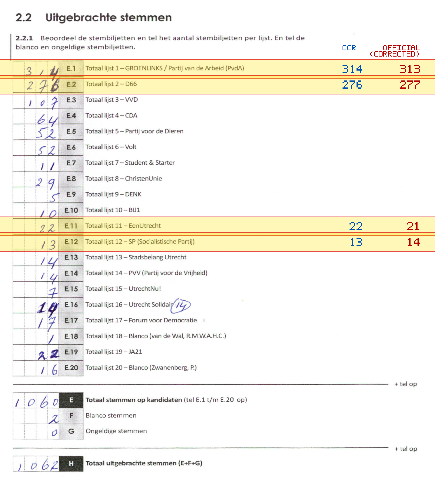
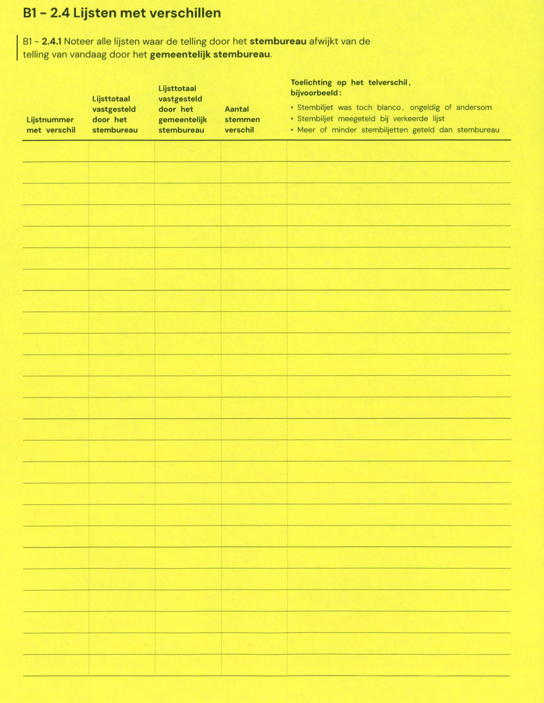

# Station 82 - Voorveldselaan 2

- Status: `mismatch`
- Markdown: `2026-GR/0344/results/Utrecht_82_USV_Hercules_GR26_eerste_telling.md`
- Correction OCR: `2026-GR/0344/results/corrections/Utrecht_82_USV_Hercules_GR26.md`

## Details

- E.1: md=314, official=313
- E.2: md=276, official=277
- E.11: md=22, official=21
- E.12: md=13, official=14

## Candidate Votes

- Status: `incomplete`
- Compared candidate cells: 0/508
- Candidate OCR files: 0
- candidate OCR not available
- known list/correction issues are shown

Legend: yellow/red = official CSV mismatch; blue = internal consistency issue. The right margin shows OCR and official values for official mismatches.



## Corrections

```markdown
| ID | First | Second | Difference | Note |
|---|---:|---:|---:|---|
```


