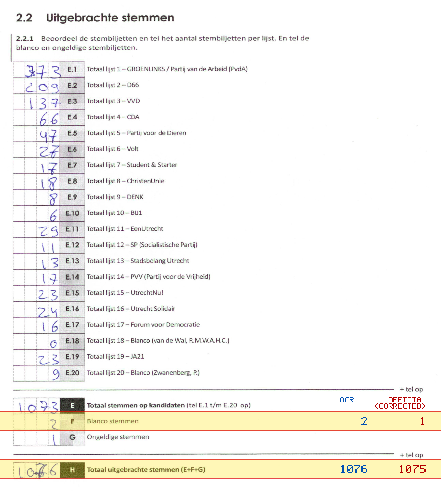
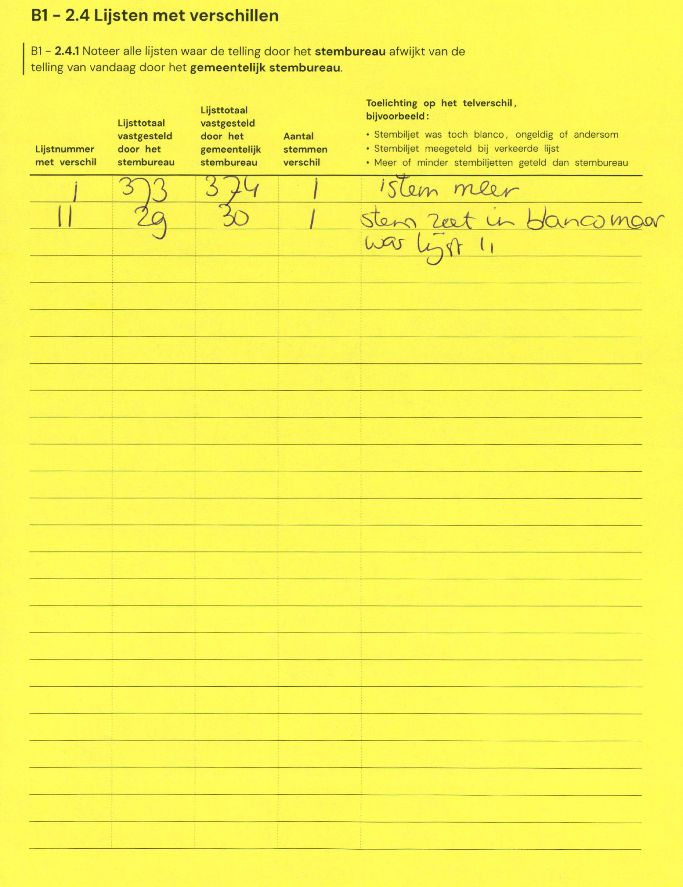

# Station 83 - Ché Guevarastraat 15 ingang via achterkant P. L. Brionstraat

- Status: `mismatch`
- Markdown: `2026-GR/0344/results/Utrecht_83_OBS_Voordorp_GR26_eerste_telling.md`
- Correction OCR: `2026-GR/0344/results/corrections/Utrecht_83_OBS_Voordorp_GR26.md`

## Details

- F: md=2, official=1
- H: md=1076, official=1075

## Candidate Votes

- Status: `incomplete`
- Compared candidate cells: 0/508
- Candidate OCR files: 0
- candidate OCR not available
- known list/correction issues are shown

Legend: yellow/red = official CSV mismatch; blue = internal consistency issue. The right margin shows OCR and official values for official mismatches.



## Corrections

```markdown
| ID | First | Second | Difference | Note |
|---|---:|---:|---:|---|
| E.1 | 373 | 374 | 1 | 1 stem meer |
| E.11 | 29 | 30 | 1 | stem zeet in blanco maar was lijst 11 |
```


