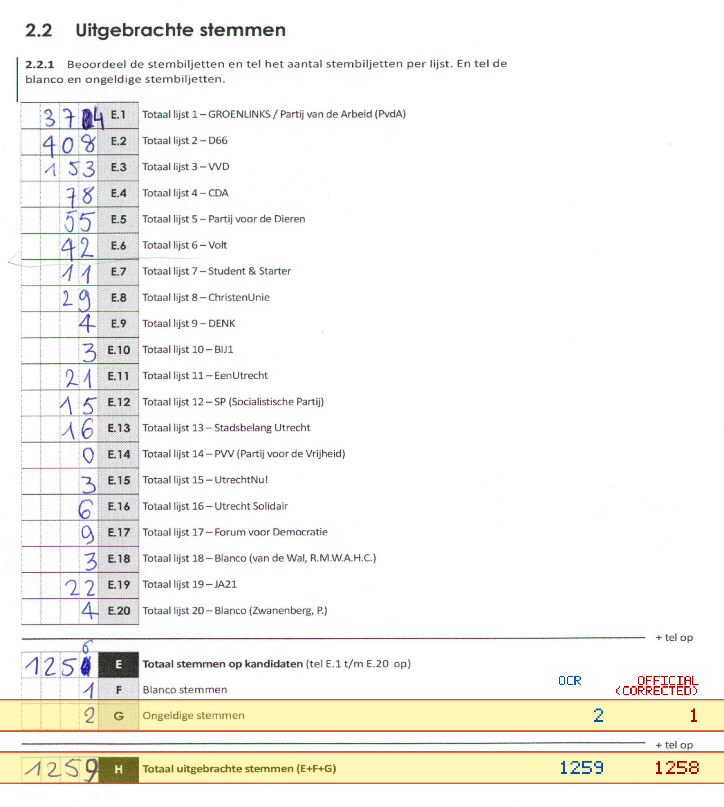
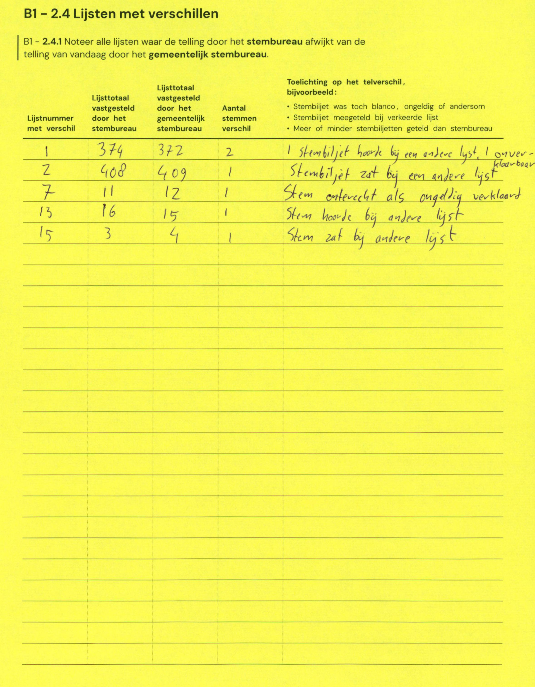

# Station 85 - Prof. van Bemmelenlaan 34 ingang via Prof. Broekemalaan

- Status: `mismatch`
- Markdown: `2026-GR/0344/results/Utrecht_85_OBS_Tuindorp_GR26_eerste_telling.md`
- Correction OCR: `2026-GR/0344/results/corrections/Utrecht_85_OBS_Tuindorp_GR26.md`

## Details

- G: md=2, official=1
- H: md=1259, official=1258

## Candidate Votes

- Status: `incomplete`
- Compared candidate cells: 0/508
- Candidate OCR files: 0
- candidate OCR not available
- known list/correction issues are shown

Legend: yellow/red = official CSV mismatch; blue = internal consistency issue. The right margin shows OCR and official values for official mismatches.



## Corrections

```markdown
| ID | First | Second | Difference | Note |
|---|---:|---:|---:|---|
| E.1 | 374 | 372 | -2 | 1 stembiljet hoorde bij een andere lijst, 1 over- |
| E.2 | 408 | 409 | 1 | Stembiljet zat bij een andere lijst |
| E.7 | 11 | 12 | 1 | Stem onterecht als ongeldig verklaard |
| E.13 | 16 | 15 | -1 | Stem hoorde bij andere lijst |
| E.15 | 3 | 4 | 1 | Stem zat bij andere lijst |
```


