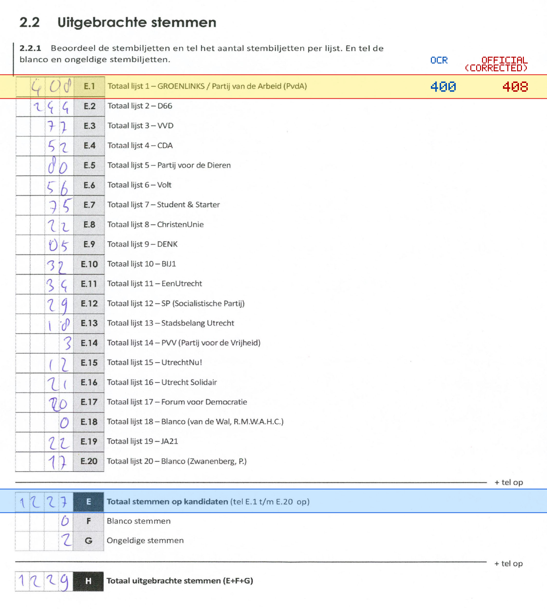
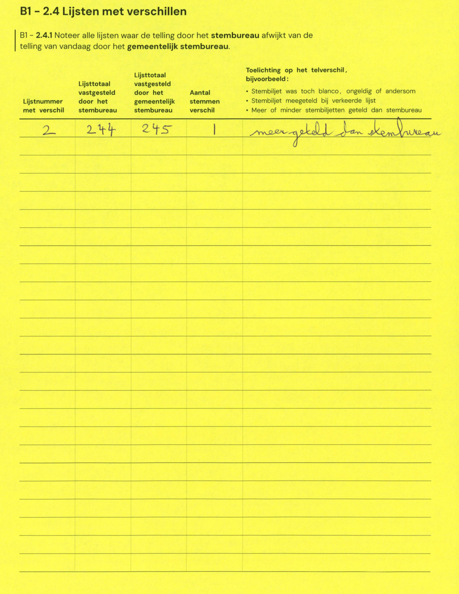

# Station 88 - Kruisstraat 201

- Status: `internally inconsistent`
- Markdown: `2026-GR/0344/results/Utrecht_88_Parnassos_GR26_eerste_telling.md`
- Correction OCR: `2026-GR/0344/results/corrections/Utrecht_88_Parnassos_GR26.md`

## Details

- E.1 through E.20 sum to 1219, but E is 1227
- E.1: md=400, official=408

Legend: yellow/red = official CSV mismatch; blue = internal consistency issue. The right margin shows OCR and official values for official mismatches.



## Corrections

```markdown
| ID | First | Second | Difference | Note |
|---|---:|---:|---:|---|
| E.2 | 244 | 245 | 1 | meer geteld dan stembureau |
```


