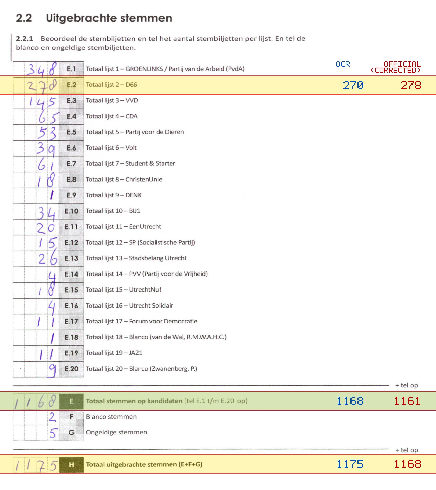
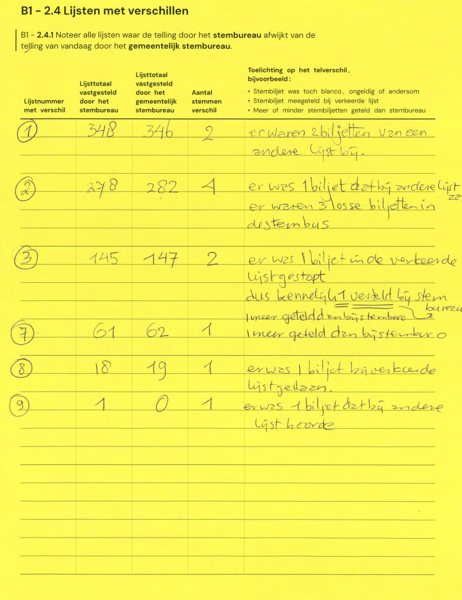

# Station 90 - Schoolplein 6 ingang via Schoolstraat

- Status: `internally inconsistent`
- Markdown: `2026-GR/0344/results/Utrecht_90_Gymzaal_Schoolplein_GR26_eerste_telling.md`
- Correction OCR: `2026-GR/0344/results/corrections/Utrecht_90_Gymzaal_Schoolplein_GR26.md`

## Details

- E.1 through E.20 sum to 1153, but E is 1168
- E.2: md=270, official=278
- E: md=1168, official=1161
- H: md=1175, official=1168

Legend: yellow/red = official CSV mismatch; blue = internal consistency issue. The right margin shows OCR and official values for official mismatches.



## Corrections

```markdown
| ID | First | Second | Difference | Note |
|---|---:|---:|---:|---|
| E.1 | 348 | 346 | -2 | er waren 2 biljetten van een andere lijst bij |
| E.2 | 278 | 282 | 4 | er was 1 biljet dat bij andere lijst er waren 3 losse biljetten in stembus |
| E.3 | 145 | 147 | 2 | er was 1 biljet in de verkeerde lijst gestopt dus kennelijk 1 verteld bij stembureau 1 meer geteld dan bij stembureau |
| E.7 | 61 | 62 | 1 | 1 meer geteld dan bij stembureau |
| E.8 | 18 | 19 | 1 | er was 1 biljet bij verkeerde lijst gelezen |
| E.9 | 1 | 0 | -1 | er was 1 biljet dat bij andere lijst hoorde |
```


