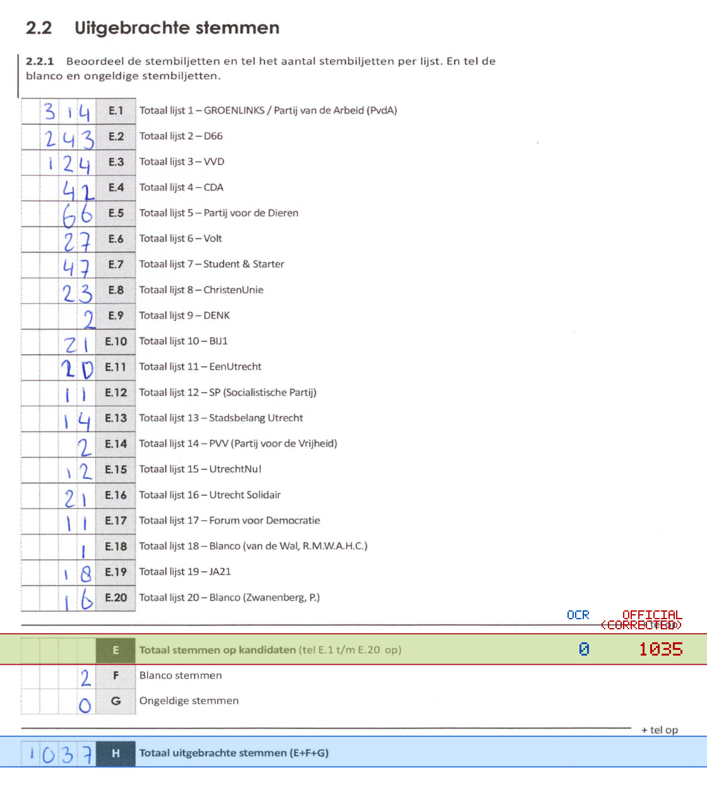
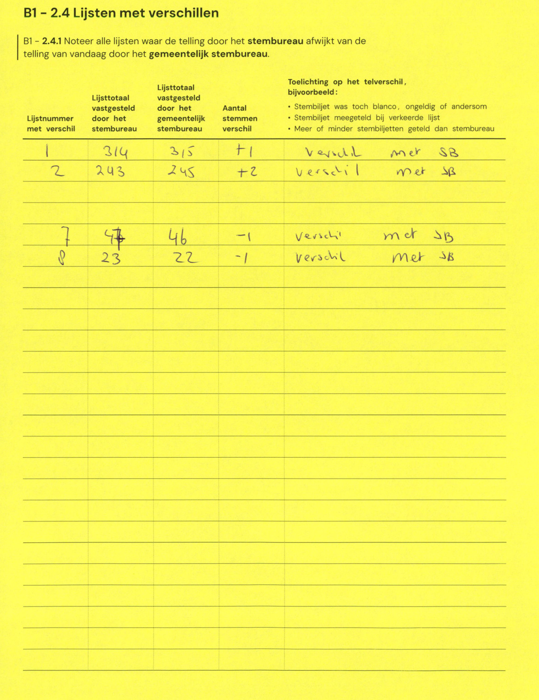

# Station 91 - Oudwijkerdwarsstraat 148

- Status: `internally inconsistent`
- Markdown: `2026-GR/0344/results/Utrecht_91_Podium_Oost_GR26_eerste_telling.md`
- Correction OCR: `2026-GR/0344/results/corrections/Utrecht_91_Podium_Oost_GR26.md`

## Details

- E.1 through E.20 sum to 1035, but E is 0
- E + F + G is 2, but H is 1037
- E: md=0, official=1035

Legend: yellow/red = official CSV mismatch; blue = internal consistency issue. The right margin shows OCR and official values for official mismatches.



## Corrections

```markdown
| ID | First | Second | Difference | Note |
|---|---:|---:|---:|---|
| E.1 | 314 | 315 | 1 | vermeld met SB |
| E.2 | 243 | 245 | 2 | verschil met SB |
| E.7 | 47 | 46 | -1 | verschil met SB |
| E.8 | 23 | 22 | -1 | verschil met SB |
```


