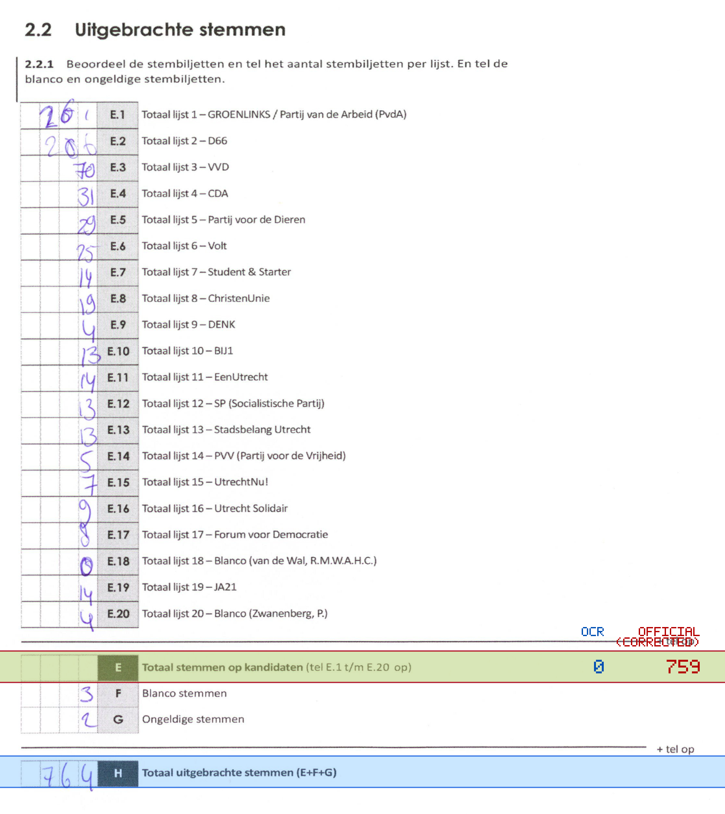
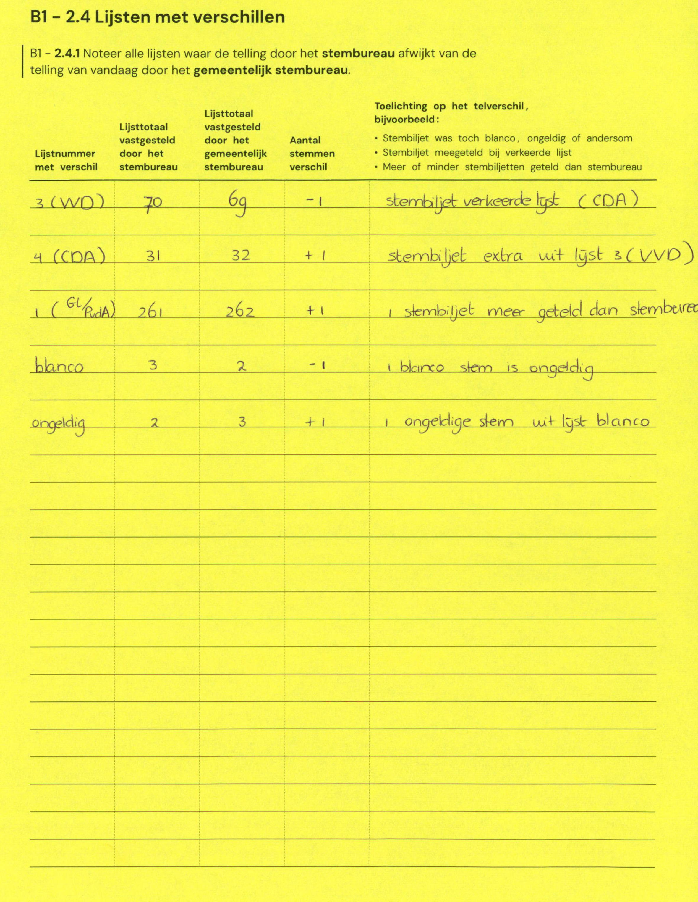

# Station 93 - Homeruslaan 40 ingang via gymzaal Minervaplein

- Status: `internally inconsistent`
- Markdown: `2026-GR/0344/results/Utrecht_93_Basisschool_De_Odyssee_GR26_eerste_telling.md`
- Correction OCR: `2026-GR/0344/results/corrections/Utrecht_93_Basisschool_De_Odyssee_GR26.md`

## Details

- E.1 through E.20 sum to 759, but E is 0
- E + F + G is 5, but H is 764
- E: md=0, official=759

## Candidate Votes

- Status: `incomplete`
- Compared candidate cells: 0/508
- Candidate OCR files: 0
- candidate OCR not available
- known list/correction issues are shown

Legend: yellow/red = official CSV mismatch; blue = internal consistency issue. The right margin shows OCR and official values for official mismatches.



## Corrections

```markdown
| ID | First | Second | Difference | Note |
|---|---:|---:|---:|---|
| E.3 | 70 | 69 | -1 | stembiljet verkeerde lijst (CDA) |
| E.4 | 31 | 32 | 1 | stembiljet extra uit lijst 3 (VVD) |
| E.1 | 261 | 262 | 1 | stembiljet meer geteld dan stembureau |
| F | 3 | 2 | -1 | 1 blanco stem is ongeldig |
| G | 2 | 3 | 1 | 1 ongeldige stem uit lijst blanco |
```


