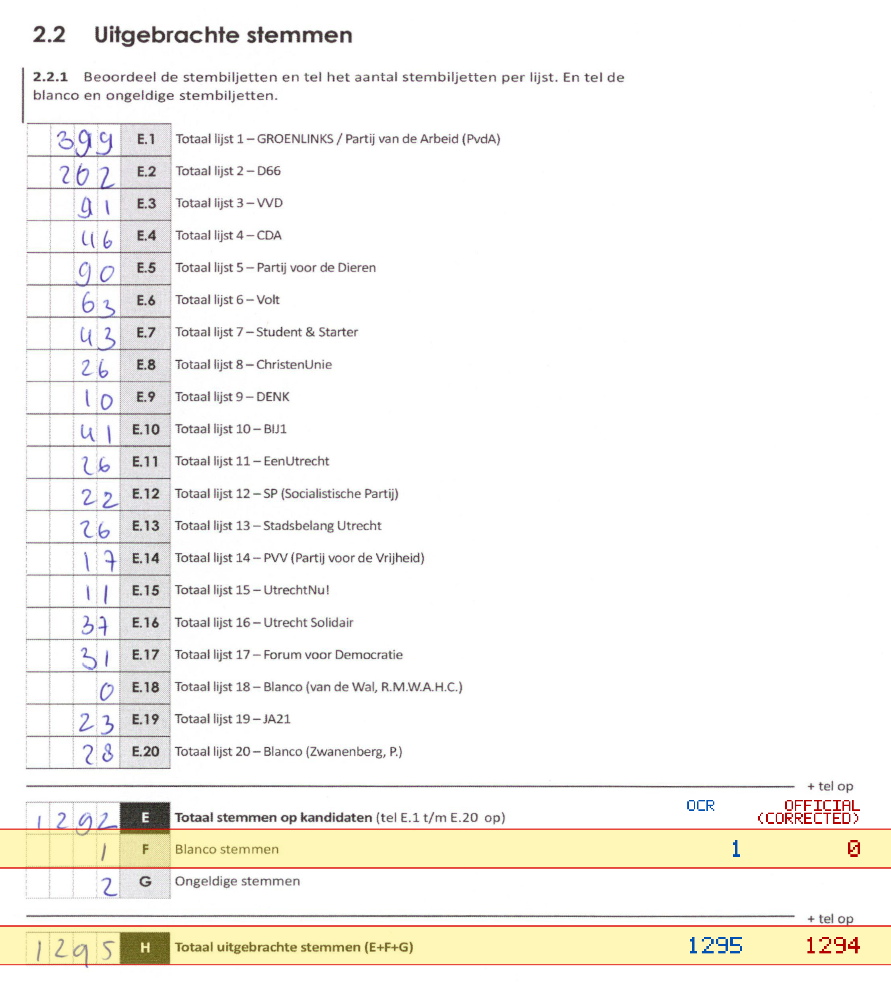
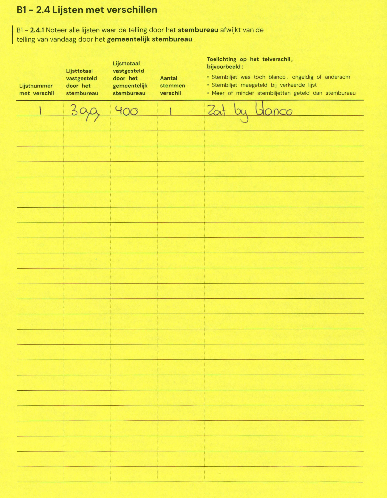

# Station 94 - Alkhof 55-58 ingang via Gansstraat

- Status: `mismatch`
- Markdown: `2026-GR/0344/results/Utrecht_94_Geerteschool_GR26_eerste_telling.md`
- Correction OCR: `2026-GR/0344/results/corrections/Utrecht_94_Geerteschool_GR26.md`

## Details

- F: md=1, official=0
- H: md=1295, official=1294

Legend: yellow/red = official CSV mismatch; blue = internal consistency issue. The right margin shows OCR and official values for official mismatches.



## Corrections

```markdown
| ID | First | Second | Difference | Note |
|---|---:|---:|---:|---|
| E.1 | 399 | 400 | 1 | zat bij blanco |
```


